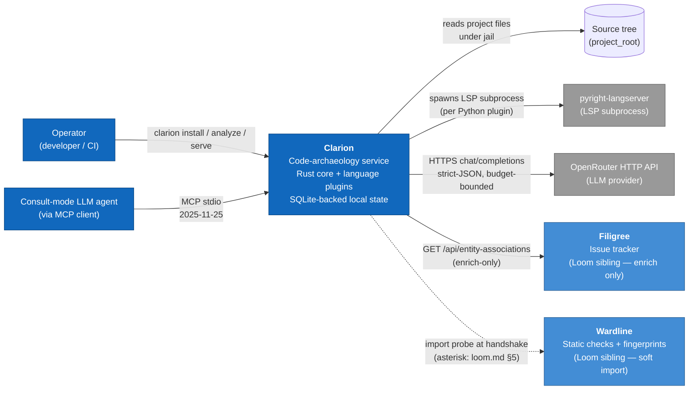
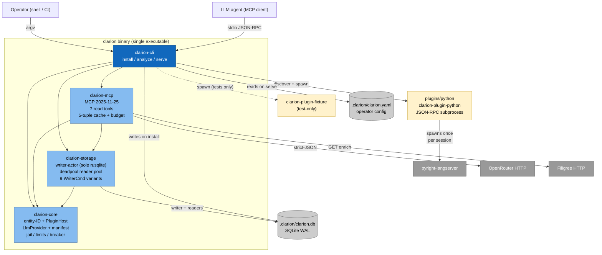
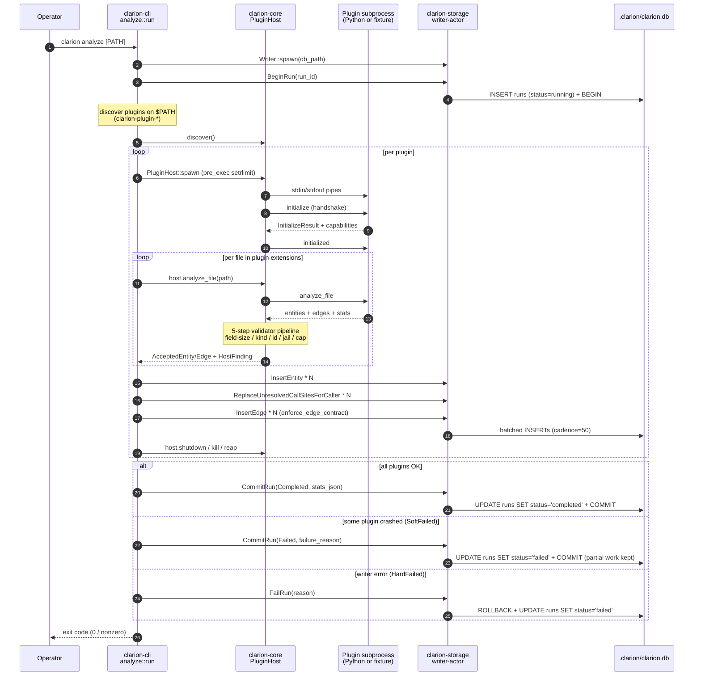
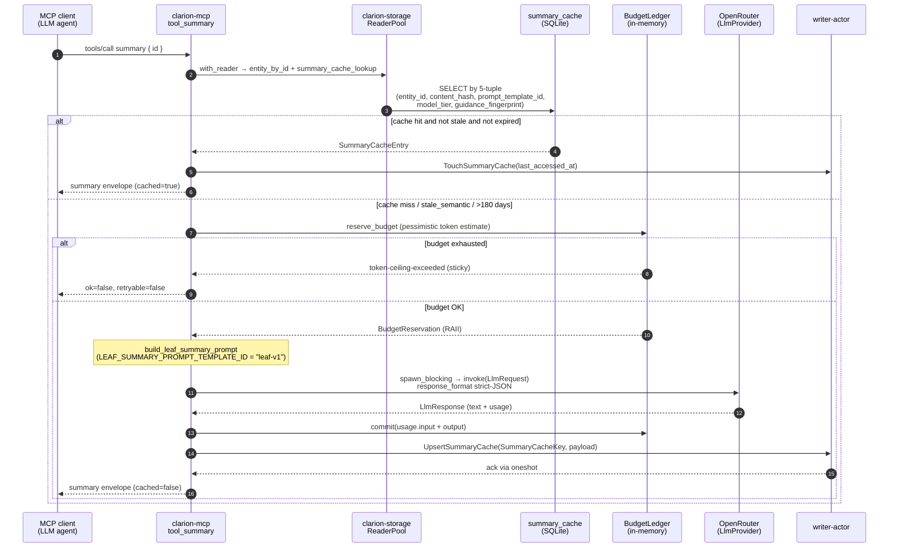
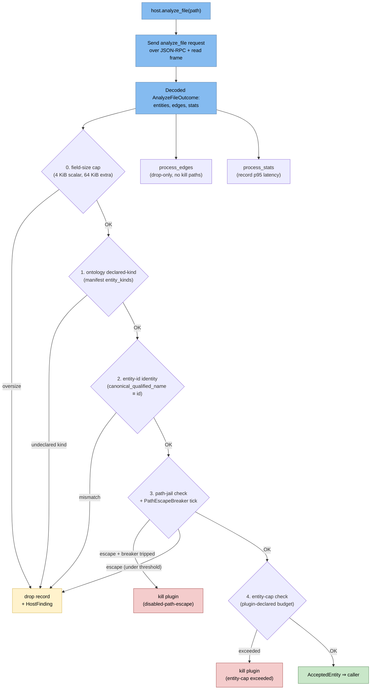

# 03 — Architecture Diagrams

**Repository:** `/home/john/clarion`
**Branch:** `sprint-2/b8-scale-test`
**Generated:** 2026-05-18

All diagrams are Mermaid, validated through the Mermaid Live renderer. They draw from `01-discovery-findings.md` and `02-subsystem-catalog.md`.

Five views, in the C4-inspired order — context, container, then two narrative sequences and one component zoom.

---

## 1 — System Context (C4 L1): Clarion in the Loom federation

Clarion-as-a-system, the actors and the external systems it talks to. The two solid blue siblings (Filigree, Wardline) are owned by the same author and explicitly enrich-only / soft-import per `docs/suite/loom.md` §3–§5. The dashed line to Wardline marks the named v0.1 doctrine asterisk.

**Key facts:**
- One operator + one MCP client are the primary actors.
- Two outbound HTTP integrations (OpenRouter, Filigree) plus one subprocess (pyright). Wardline is import-only.
- The MCP wire is stdio, not HTTP — `clarion serve` runs in the foreground of the agent's process tree.

---

## 2 — Container view (C4 L2): inside the binary

The `clarion` binary is the only deployment artifact. Five workspace crates inside it; two subprocess-protocol peers (one real Python plugin, one test fixture); three external endpoints; two persistent files under `.clarion/`.

**Things worth noting:**
- The Rust crate graph is acyclic: `cli` → {`mcp`, `storage`, `core`}; `mcp` → {`storage`, `core`}; `storage` → `core` (one symbol, `EdgeConfidence`).
- The Python plugin is *not* a Rust crate; the only "dep" is the host-spawn-subprocess contract.
- The MCP server speaks a separate stdio session from the analyze run. They can be running concurrently against the same `.clarion/clarion.db`; correctness relies entirely on `clarion-storage`'s WAL + `busy_timeout=5000` pragma discipline.

---

## 3 — `clarion analyze` run (sequence)

The happy path and the two named failure modes (`SoftFailed`, `HardFailed`). The `RunOutcome` taxonomy is at `crates/clarion-cli/src/analyze.rs:558–563`; the three terminal branches differ by *which* `WriterCmd` they send.

**Key invariants:**
- All writes funnel through a single writer-actor task that owns the sole `rusqlite::Connection` (ADR-011).
- The five-step host validator pipeline is the place where plugin-side guarantees become host-side facts: field-size, kind-declared, entity-id-matches, path-jail, entity-cap. Steps 0–2 only drop offending records; steps 3–4 escalate to plugin termination on breaker trip.
- The `SoftFailed` branch is the one path where the same SQLite transaction carries both accepted entities *and* a `UPDATE runs SET status='failed'` — a partial-work-with-marker invariant.

---

## 4 — MCP `summary` tool with cache miss → LLM dispatch (sequence)

The richest narrative path in the codebase: the ADR-007 5-tuple cache lookup, budget reservation, `spawn_blocking` to the synchronous `LlmProvider`, JSON-shape validation, and writeback via the writer-actor.

**Notes that don't fit on the diagram:**
- The 4-tuple `InferredEdgeCacheKey` for the inferred-edges path is structurally identical: `(caller_entity_id, caller_content_hash, model_id, prompt_version)`. The flow looks the same except for an additional **in-flight coalescer** (`inferred_inflight: HashMap<InferredEdgeCacheKey, broadcast::Sender>`) with a 60-second timeout so concurrent identical dispatches share one LLM call.
- `BudgetLedger.blocked` is sticky for the lifetime of `ServerState` — once one reservation overshoots, every subsequent LLM tool returns `token-ceiling-exceeded` until process restart. No reset path.
- Filigree's `issues_for` path *also* uses `spawn_blocking` (for `reqwest::blocking`) — same bridging shape, no cache, three independent skip paths route to `issues_unavailable` to honour Loom's enrich-only contract.

---

## 5 — Component zoom: `clarion-core::plugin::host` validator pipeline

The internal organisation of `PluginHost::analyze_file` — the per-file dispatch shape inside the plugin host supervisor. Sourced from `crates/clarion-core/src/plugin/host.rs:1031–1198`.

**Design notes:**
- Steps 0–2 are **pure-function validators** (`oversize_field`, `oversize_edge_field`, `invalid_unresolved_call_site_reason`, `validate_kind_string`); they emit a `HostFinding` and drop the offending row.
- Steps 3–4 carry **kill paths** because they involve cross-record state: `PathEscapeBreaker` ticks once per offending entity and trips after a documented threshold, and entity-cap is a per-plugin budget that's only meaningful in aggregate.
- The same drop-on-violation discipline is applied to edges, but with **no kill paths** — edges do not participate in breakers. Trade-off: an edge-heavy file can spam many findings; an entity-heavy file is bounded by the cap.

---

## Coverage notes

| C4 level | Diagram | Subsystems covered |
|----------|---------|---------------------|
| L1 Context | #1 | Clarion as a whole, all 5 external dependencies |
| L2 Container | #2 | All 6 internal subsystems + 5 external |
| L3 Component | #5 | `clarion-core::plugin::host` (largest production file) |
| Sequence | #3 | `clarion analyze` lifecycle, all 3 terminal branches |
| Sequence | #4 | MCP `summary` LLM dispatch, ADR-007 5-tuple cache |

What's deliberately not drawn here (size / clarity vs. info-value tradeoff):
- A component view of `clarion-mcp::lib.rs` — it has a clean banded structure (protocol surface → `ServerState` → per-tool handlers → LLM pipelines → transport loop → helpers) but the 7 tools × 4 substates each would dominate a single diagram. The catalog entry's tool table is the substitute.
- A component view of `clarion-storage::writer` — the 9 `WriterCmd` variants are clean and listed in the catalog; visualising the per-variant SQL would obscure rather than illuminate.
- A schema ER diagram — the catalog's ASCII schema sketch is sufficient for v0.1's 8-table footprint.
