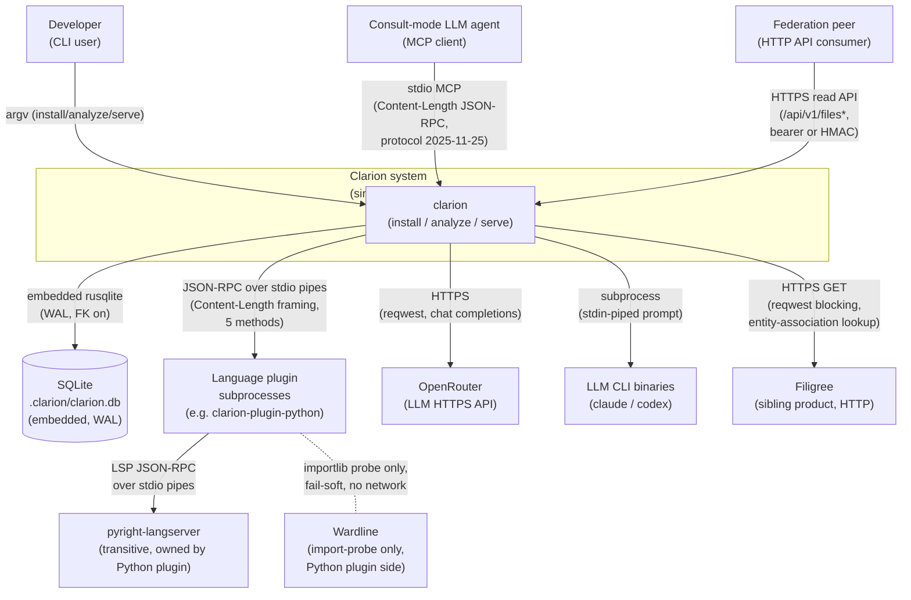
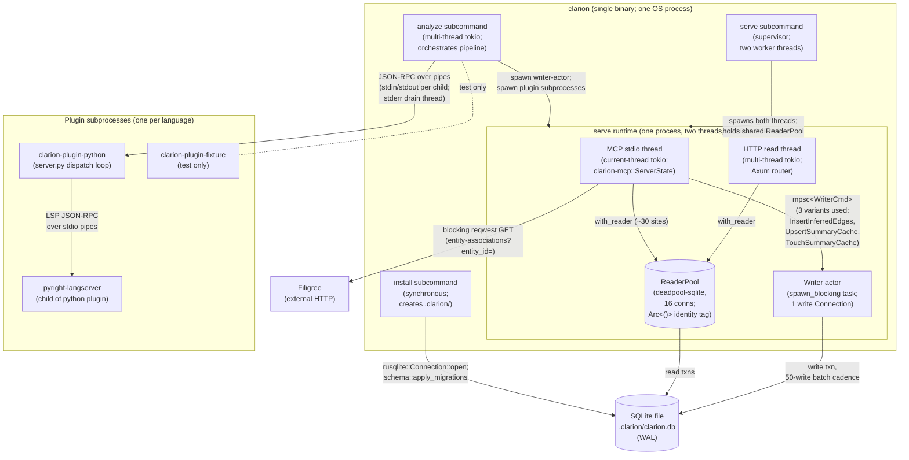
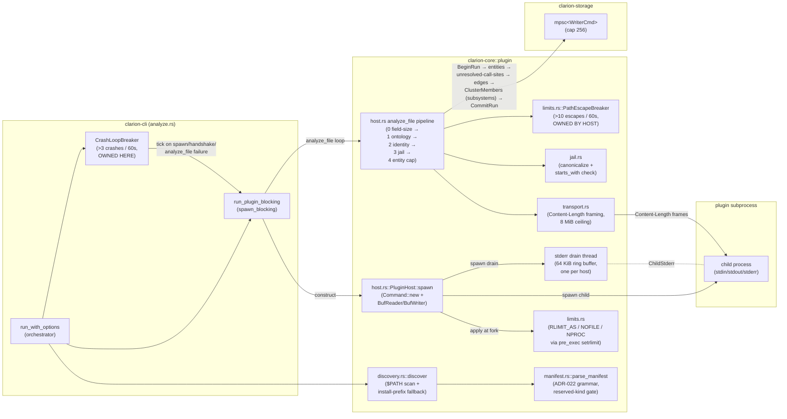
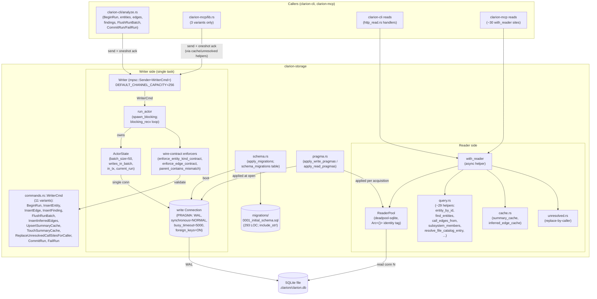
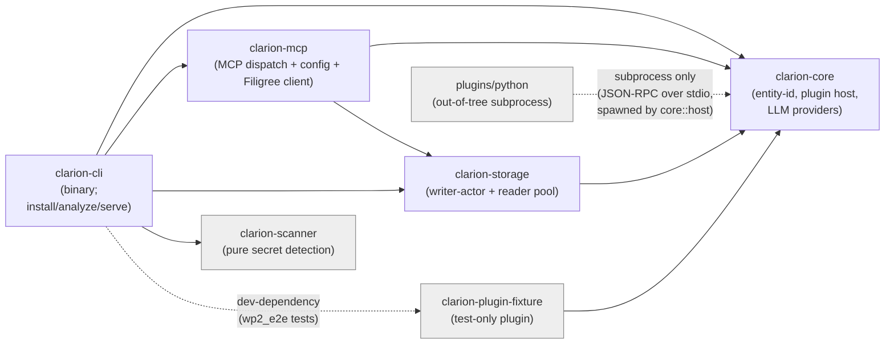

# 03 — Architecture Diagrams (Clarion)

> Derived exclusively from `01-discovery-findings.md`, `02-subsystem-catalog.md`,
> and small confirmation reads of `crates/clarion-storage/src/writer.rs`,
> `crates/clarion-mcp/src/lib.rs`, and `crates/clarion-core/src/plugin/host.rs`.
> No design docs, ADRs, or sprint narratives were read. Every node in every
> diagram traces to a file in the workspace; residual uncertainties are listed
> at the bottom.

---

## 1. C4 System Context — Clarion in its environment



Derived from `crates/clarion-cli/src/cli.rs` (three subcommands), `crates/clarion-mcp/src/lib.rs:40` (`MCP_PROTOCOL_VERSION="2025-11-25"`), `crates/clarion-cli/src/http_read.rs:347-369` (Axum router), `crates/clarion-core/src/plugin/transport.rs` (Content-Length framing), `crates/clarion-storage/src/pragma.rs:17-30` (WAL/foreign_keys), `crates/clarion-mcp/src/filigree.rs` (Filigree client), `crates/clarion-core/src/llm_provider.rs` (OpenRouter + CLI providers), `plugins/python/src/clarion_plugin_python/wardline_probe.py` (import-only probe), and `plugins/python/src/clarion_plugin_python/pyright_session.py:637-644` (pyright subprocess). Wardline is dashed because the edge is a fail-soft `importlib.import_module` probe with no production read of the result on the Rust side.

---

## 2. C4 Container — Processes and stores inside `clarion serve` and `clarion analyze`



Derived from `crates/clarion-cli/src/serve.rs:20-227` (two-thread supervisor + ReaderPool identity tag), `crates/clarion-cli/src/http_read.rs:262-311` (`run_http_read_server`), `crates/clarion-storage/src/writer.rs:79-98` (mpsc channel + `spawn_blocking` actor), `crates/clarion-storage/src/reader.rs:26-119` (deadpool reader pool with `Arc<()>` tag), `crates/clarion-mcp/src/lib.rs:316-376` (`ServerState`), `crates/clarion-storage/src/pragma.rs` (WAL discipline). Plugin subprocesses are spawned from `crates/clarion-core/src/plugin/host.rs::spawn` driven by `crates/clarion-cli/src/analyze.rs::run_plugin_blocking`.

---

## 3. C4 Component — Plugin host wired to `clarion analyze`



Derived from `crates/clarion-core/src/plugin/host.rs:384-1182` (host generic over `BufRead`/`Write`, four-stage pipeline at 866-975, spawn at 509-644, stderr drain at 614-620), `crates/clarion-core/src/plugin/{discovery,manifest,transport,jail,limits,breaker}.rs`, and `crates/clarion-cli/src/analyze.rs:240-275, 325-470, 675-906` (run loop, per-plugin blocking task, phase-3 clustering). The two breakers are drawn distinctly: `CrashLoopBreaker` lives in `analyze.rs`, `PathEscapeBreaker` lives inside the host — same shape, asymmetric ownership noted in catalog §1 patterns.

---

## 4. C4 Component — Storage layer



Derived from `crates/clarion-storage/src/writer.rs` (Writer + ActorState + `run_actor`; channel capacity at line 38, batch size at 35, 11-variant match at 154-260, wire contracts at 425-582), `crates/clarion-storage/src/reader.rs:26-119`, `crates/clarion-storage/src/query.rs` (helper catalogue), `crates/clarion-storage/src/cache.rs` and `unresolved.rs`, `crates/clarion-storage/src/schema.rs:17-91`, `crates/clarion-storage/migrations/0001_initial_schema.sql`, and `crates/clarion-storage/src/pragma.rs:16-45`. The "3 variants only" annotation on the MCP-side writer arrow matches catalog §4: `InsertInferredEdges`, `UpsertSummaryCache`, `TouchSummaryCache`.

---

## 5. Sequence — `clarion analyze` happy path

```mermaid
sequenceDiagram
    autonumber
    actor user as Developer
    participant cli as clarion-cli<br/>analyze::run_with_options
    participant inst as install (idempotent)
    participant rl as run_lifecycle.rs
    participant wact as Writer actor<br/>(spawn_blocking)
    participant disc as core::plugin::discovery
    participant walk as ignore::WalkBuilder
    participant ssc as clarion-scanner +<br/>secret_scan (parallel)
    participant brk as CrashLoopBreaker
    participant host as PluginHost
    participant child as plugin subprocess
    participant clust as clustering.rs (Leiden)
    participant db as SQLite (WAL)

    user->>cli: clarion analyze <path>
    cli->>inst: ensure .clarion/ exists,<br/>apply_migrations (idempotent)
    inst-->>cli: schema ready
    cli->>cli: load AnalyzeConfig from clarion.yaml
    cli->>rl: recover_preexisting_running_runs<br/>(raw UPDATE runs SET status='failed')
    rl-->>cli: ok
    cli->>wact: Writer::spawn(db_path, 50, 256)
    wact-->>cli: (Writer, JoinHandle)
    cli->>cli: mint run_id

    cli->>disc: discover() on $PATH
    disc-->>cli: Vec<DiscoveredPlugin>

    cli->>walk: collect_source_files<br/>(extension union, .gitignore)
    walk-->>cli: file list

    cli->>ssc: pre_ingest scan (thread::scope,<br/>available_parallelism workers)
    ssc-->>cli: SuppressionResult,<br/>briefing_blocked set

    cli->>wact: BeginRun(run_id)
    wact->>db: BEGIN; INSERT runs status='running'
    wact-->>cli: ack

    loop per discovered plugin
        cli->>brk: tick? (still healthy)
        brk-->>cli: ok
        cli->>host: spawn(manifest, project_root)
        host->>child: fork+exec, pre_exec setrlimit
        host->>child: initialize / initialized
        loop per filtered source file
            cli->>host: analyze_file(path)
            host->>child: JSON-RPC analyze_file
            child-->>host: {entities, edges, stats}
            host->>host: 4-stage pipeline<br/>(ontology, identity,<br/>jail, entity cap)
        end
        host->>child: shutdown / exit
        host-->>cli: AnalyzeFileOutcome[],<br/>findings, unresolved-call-sites
        cli->>brk: tick(success) or tick(crash)
        Note over cli,brk: >3 crashes / 60s →<br/>FINDING_DISABLED_CRASH_LOOP,<br/>skip remaining plugins
    end

    cli->>wact: InsertEntity × N
    wact->>db: per-50 COMMIT; BEGIN cadence
    cli->>wact: ReplaceUnresolvedCallSitesForCaller × M
    cli->>wact: InsertEdge × K<br/>(FK ordering: entities first)
    cli->>wact: InsertFinding × F (secret-scan findings)

    cli->>wact: FlushRunBatch
    wact->>db: COMMIT; BEGIN
    cli->>clust: cluster_modules<br/>(Leiden via xgraph;<br/>fallback: weighted-components)
    clust-->>cli: communities + modularity_score
    cli->>wact: InsertEntity (core:subsystem:<hash>) × C
    cli->>wact: InsertEdge (in_subsystem) × M

    cli->>wact: CommitRun(Completed | SoftFailed)
    wact->>db: parent↔contains mismatch check;<br/>UPDATE runs ... ;<br/>COMMIT
    wact-->>cli: ack
    cli-->>user: exit 0
```

Derived from `crates/clarion-cli/src/analyze.rs:75-645` (`run_with_options`), `crates/clarion-cli/src/run_lifecycle.rs:6-44`, `crates/clarion-storage/src/writer.rs:142-260, 802-877` (per-50 batch cadence, parent↔contains check inside CommitRun at 894-918), `crates/clarion-cli/src/secret_scan.rs:202-382`, `crates/clarion-cli/src/clustering.rs:53-145`, and the host pipeline in `crates/clarion-core/src/plugin/host.rs:866-975`.

---

## 6. Sequence — `clarion serve` MCP tool call

```mermaid
sequenceDiagram
    autonumber
    actor agent as Consult-mode LLM agent
    participant mcp as clarion-mcp<br/>serve_stdio_with_state
    participant disp as ServerState::handle_json_rpc
    participant pool as ReaderPool
    participant q as clarion-storage query.rs
    participant wact as Writer actor<br/>(via mpsc)
    participant db as SQLite

    Note over agent,mcp: stdio framing auto-detected:<br/>Content-Length or JSON-line

    agent->>mcp: write frame (tools/call)
    mcp->>mcp: read_stdio_frame (blocking)
    mcp->>disp: runtime.block_on(handle_frame_with_state)
    disp->>disp: validate method+name<br/>against list_tools()

    alt read-only tool<br/>(entity_at, find_entity, callers_of[resolved],<br/>subsystem_members, etc.)
        disp->>pool: with_reader(|conn| ...)
        pool->>q: e.g. entity_at_line,<br/>find_entities,<br/>call_edges_from
        q->>db: SELECT ...
        db-->>q: rows
        q-->>pool: typed records
        pool-->>disp: result
    else write-touching tool<br/>(only 3 variants from MCP)
        disp->>wact: send WriterCmd::InsertInferredEdges<br/>or UpsertSummaryCache<br/>or TouchSummaryCache
        Note over disp,wact: gated by BudgetLedger;<br/>InferredInflight coalesces<br/>concurrent identical requests
        wact->>db: write outside run-batch txn
        wact-->>disp: oneshot ack
    end

    disp-->>mcp: envelope JSON
    mcp->>mcp: write_stdio_response<br/>(same framing as request)
    mcp-->>agent: framed response
```

Derived from `crates/clarion-mcp/src/lib.rs:56-258` (`list_tools`, 20 `ToolDefinition` hits — 19 distinct tool entries + the struct definition; catalog §4 flagged the count drift against the discovery doc), `lib.rs:295-488` (`handle_json_rpc` + `handle_tool_call` 19-arm match), `lib.rs:1560-2030` (inferred-edge dispatch + `BudgetLedger` + `InferredInflight`), `lib.rs:2704-2876` (dual-framing transport), and the writer-channel emission sites at `lib.rs:1682, 1824, 1924, 2024` (3 distinct `WriterCmd` variants).

---

## 7. Subsystem dependency graph



Derived from per-subsystem **Outbound deps** and **Inbound** sections of `02-subsystem-catalog.md`: `clarion-cli` depends on all four library crates and dev-depends on the fixture; `clarion-mcp` depends on `core` + `storage` only; `clarion-storage` depends only on `clarion-core` (one type re-export and one direct facade reach into `manifest::RESERVED_ENTITY_KINDS`); `clarion-scanner` has zero internal Clarion deps; the Python plugin has no Rust dependency edge — it interacts only as a subprocess driven by `core::plugin::host`. The dashed Python-plugin edge captures that wire relationship, not a build-graph edge.

---

## Residual uncertainties

- **Exact tool count.** Catalog §4 reports 19 distinct `ToolDefinition` entries; discovery §5 reports 20 (`grep -c 'ToolDefinition {'` = 20, which also matches a confirmation grep). The discrepancy is the trailing struct-definition match at `lib.rs:47`. Sequence diagram §6 uses the 19-entry figure for the dispatch match.
- **Wardline probe semantics.** Diagrams show the Python plugin's import-only probe as a dashed edge; the Rust-side consumption of the probe result (the manifest `wardline_aware = true` flag and any `capabilities.wardline` channel in the `initialize` response) was not analysed — catalog §1 and §7 both flag this.
- **HTTP auth selection.** The HTTP container diagram does not branch on bearer vs HMAC vs `trust-loopback`; catalog §3 records that selection is config-driven (HMAC preferred when `identity_token_env` set, bearer when only `token_env` set, none when neither). Sequence-level auth was out of scope for this pass.
- **Phase-3 clustering raw connection.** Diagram §5 shows clustering happening after a `FlushRunBatch`, but does not depict that the clustering pass opens a *direct* `rusqlite::Connection` bypassing the reader pool (catalog §3 concerns). The diagram aggregates it into the `clust` participant.
- **Federation `/api/v1/_capabilities` unauthenticated route.** The container and context diagrams collapse all four HTTP routes into one labelled edge; the unprotected capabilities route is not visually distinguished.
- **`analyze` subcommand reachable inside `serve`.** `clarion-mcp` tools `analyze_start` / `analyze_status` / `analyze_cancel` spawn `clarion analyze` as a child of `clarion serve` (catalog §4 key components). This re-entry is not drawn in diagram §2 to keep the container shape readable; it appears implicitly via the MCP tool surface in diagram §6.
- **LLM CLI providers.** The context diagram shows `claude` / `codex` CLI binaries as external processes; they are spawned by `clarion-core::llm_provider`'s `ClaudeCliProvider` / `CodexCliProvider`, but the host-side timeout/reaper-thread machinery is not drawn.
