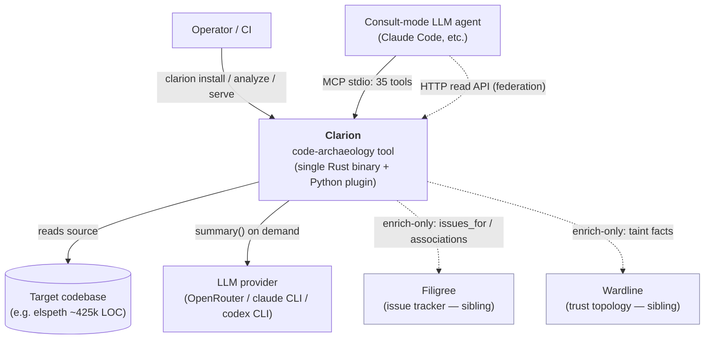
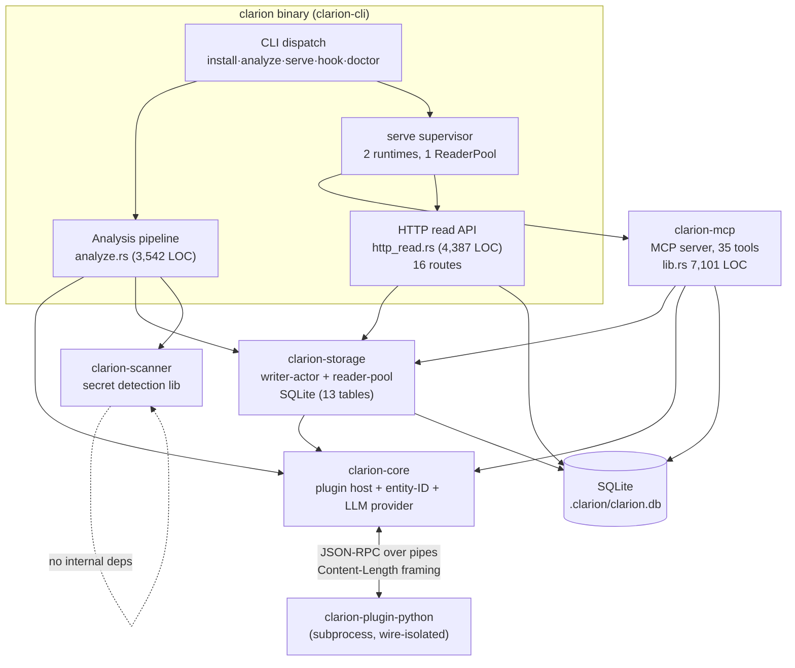
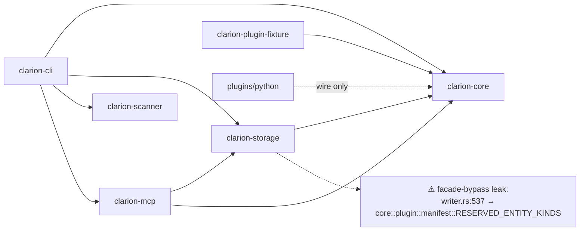
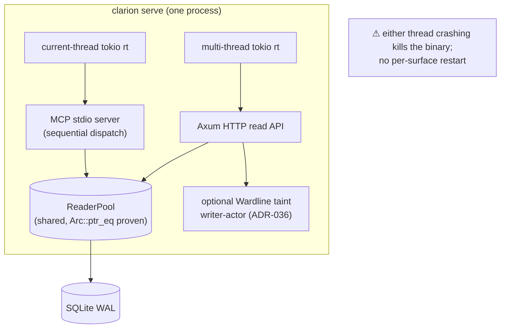
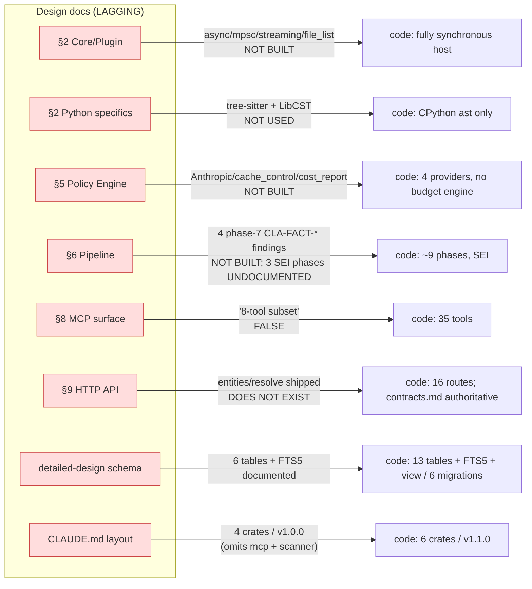

# 03 — Architecture Diagrams

**Date:** 2026-06-02 · v1.1.0. Mermaid; render in any Mermaid-aware viewer.

---

## C4 Level 1 — System Context



Dotted = enrich-only / optional (Loom federation axiom: Clarion is solo-useful; siblings add information, never define semantics).

---

## C4 Level 2 — Containers / Crates



---

## Inter-crate dependency DAG (no cycles)



`clarion-core` is the DAG bottom; `clarion-storage`/`clarion-scanner` are lower-layer; `clarion-cli`/`clarion-mcp` are consumers. The Python plugin shares no Rust dep.

---

## Component — `clarion analyze` pipeline (current ~9 phases)

```mermaid
sequenceDiagram
    participant CLI as run_with_options
    participant W as writer-actor
    participant Sc as scanner driver
    participant PH as PluginHost
    participant Py as python plugin
    participant Cl as clustering

    CLI->>W: orphan-run recovery (UPDATE runs SET failed WHERE running)
    Note over CLI: Wave-2 incremental file-hash skip
    CLI->>Sc: parallel secret scan (BEFORE BeginRun)
    CLI->>W: BeginRun (mint run_id)
    CLI->>PH: discover $PATH clarion-plugin-*
    loop per plugin (spawn_blocking)
        PH->>Py: initialize / analyze_file × N / shutdown
        Py-->>PH: entities + edges
        Note over PH: 4-stage validation;<br/>PathEscapeBreaker (host)
        Note over CLI: CrashLoopBreaker (run loop)
        PH-->>W: entities → unresolved → edges (FK order)
    end
    CLI->>Cl: Leiden clustering (deterministic seed) + fallback
    CLI->>W: CommitRun(Completed)
    Note over CLI,W: Wave-1 SEI mint pass (post-commit, enrich-only, --no-sei skippable)
```

---

## Component — `clarion serve` topology



---

## DRIFT map — design doc vs shipped code



Red = the doc is the bug (per CLAUDE.md precedence: code wins over a contradicting design doc). Triage and code-vs-doc resolution in `06-architect-handover.md`. (ADR-013's GCP-rule "drift" was a validation strawman — doc and code agree — and has been dropped.)
