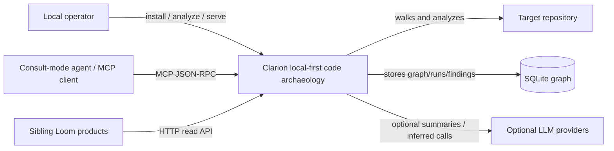
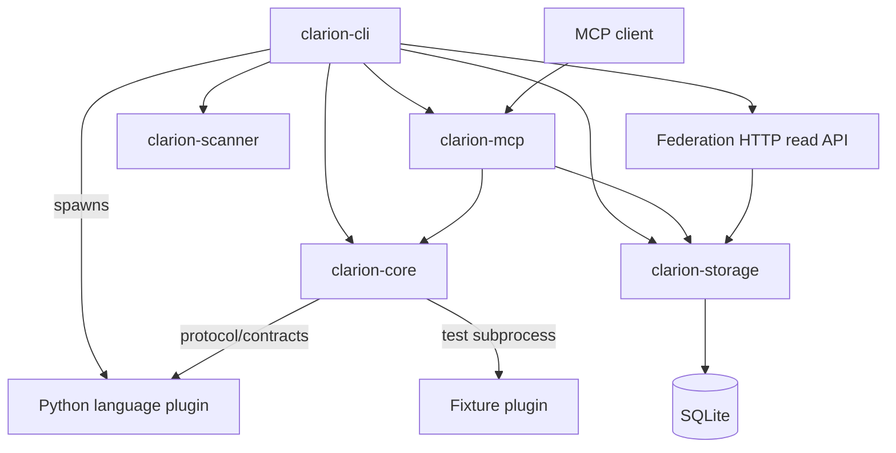
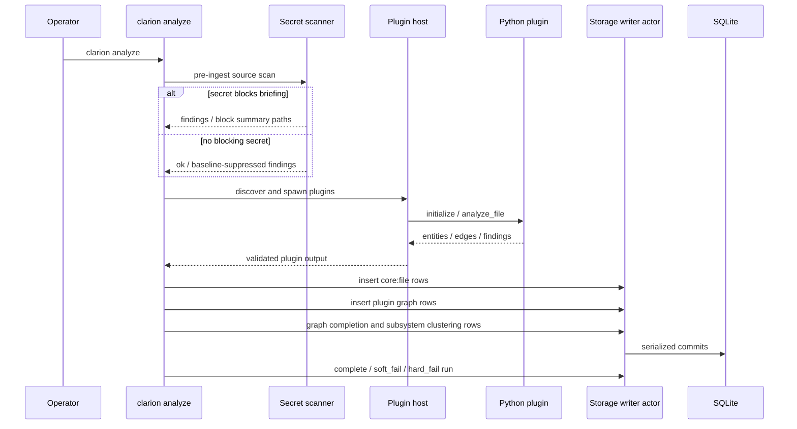
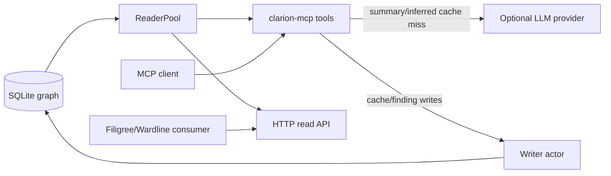
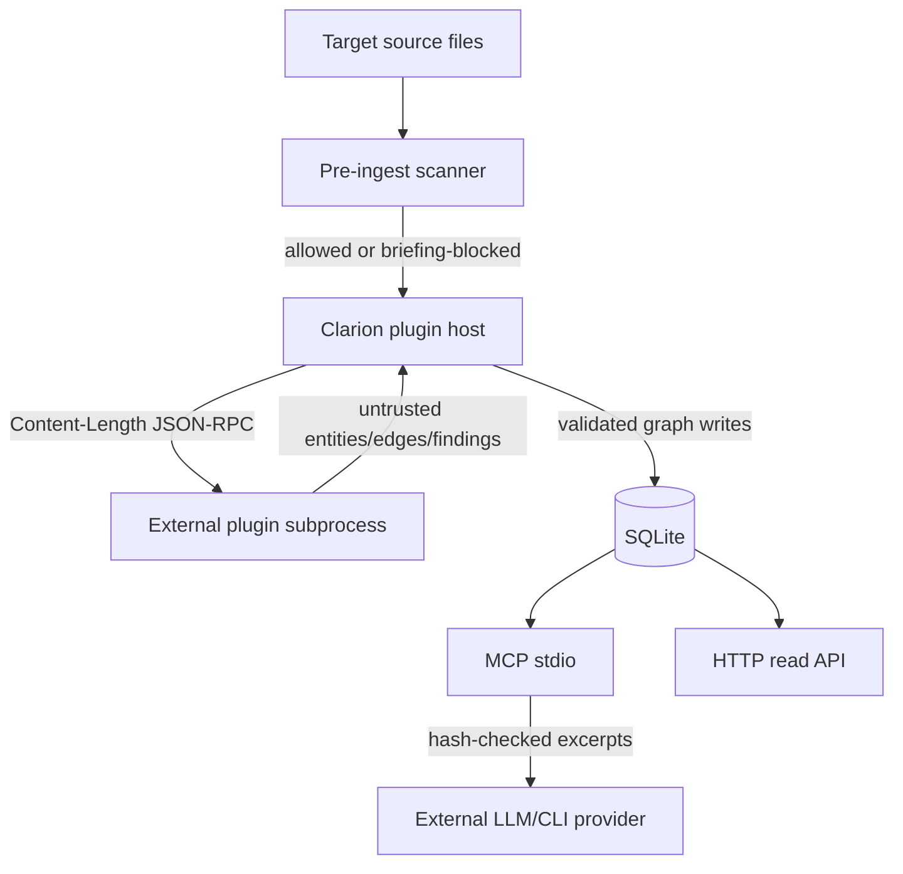
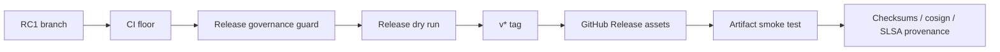

# RC1 Architecture Diagrams

These diagrams are text-native so they remain reviewable in the implementation
archive.

## C4 Context

## Container View

## Analyze Pipeline

## Serve And Query Flow

## Trust Boundaries

## Release Lane

## Notes

- Clarion has one durable local graph store. Sibling products enrich Clarion
  through APIs, not shared runtime.
- The strongest architectural boundary is the storage writer actor: durable
  mutation is serialized while reads are pooled.
- The most sensitive data boundary is source-to-LLM; scanner blocking, source
  hashes, live-provider opt-in, and token budgets all participate in this
  control.
