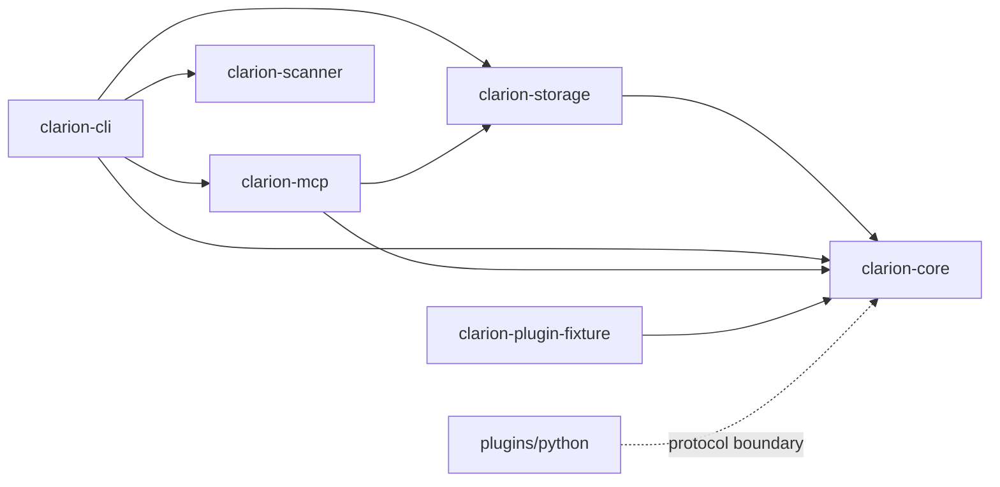

# RC1 Dependency Analysis

## Internal Dependency Graph

## Internal Coupling Notes

- `clarion-core` is the contract root. Changes to plugin protocol, entity IDs,
  resource limits, or LLM provider abstractions can affect most of the
  workspace.
- `clarion-storage` depends on core ontology and is consumed by CLI, MCP, and
  HTTP read paths.
- `clarion-cli` is the orchestration hub and therefore depends on almost every
  Rust crate.
- `clarion-mcp` depends on storage/core and has optional outward coupling to
  Filigree HTTP.
- `clarion-scanner` is intentionally small and mostly leaf-like.
- `plugins/python` is coupled through process protocol and manifest metadata
  rather than Rust linking.

## External Dependencies By Area

| Area | Key Dependencies | Risk Notes |
|---|---|---|
| Async/runtime | `tokio`, `axum`, `tower` | HTTP and serve behavior depend on version-compatible middleware semantics. |
| SQLite | `rusqlite`, `deadpool-sqlite` | Storage correctness depends on connection pragmas and transaction discipline. |
| Serialization/config | `serde`, `serde_json`, `serde_norway`, `toml` | Good fit; avoid ad hoc parsing around public contracts. |
| Graph/clustering | `xgraph` and local clustering code | Determinism/perf need release evidence. |
| HTTP clients | `reqwest` | Used for OpenRouter and Filigree integration. |
| Regex/scanning | `regex`, `sha1` | Scanner uses SHA-1 for detect-secrets-compatible hashes, not signing. |
| Release | GitHub Actions, cosign, SLSA generator | Requires live repository policy alignment. |
| Python plugin | `pyright==1.1.409`, `packaging` | Pin drift risk between manifest and package metadata. |
| Optional providers | OpenRouter, Codex CLI, Claude CLI | Live-provider opt-in and usage accounting must remain conservative. |
| Optional siblings | Filigree, Wardline | Must remain enrich-only integrations. |

## Dependency Risks

### Core/Storage Ontology Drift

Edge/entity ontology changes must stay synchronized across core manifests,
storage writer validation, schema assumptions, MCP queries, and tests.

### Python Plugin Pin Drift

`plugin.toml` and `pyproject.toml` duplicate the Pyright version. Add a direct
drift test before release hardening is considered complete.

### Wardline Optional Integration Drift

Wardline bounds are duplicated in plugin manifest and server constants. Because
Wardline is optional, drift can hide until an operator enables it.

### HMAC Implementation

HTTP auth depends on local code plus `sha2` rather than a dedicated HMAC crate.
Future edits should be reviewed as security-sensitive.

### Live Provider Accounting

Codex CLI usage parsing can skip malformed JSONL and warn that token totals
become a lower bound. Token budget enforcement remains useful but may be
conservative/incomplete when provider telemetry is malformed.

### Release Supply Chain

Static workflow checks are only half the story. Live GitHub policy must match
the release-governance expectations.

## Dependency Recommendations

1. Keep optional sibling integrations optional and fail-soft.
2. Add duplicate-fact drift tests for plugin/provider metadata.
3. Prefer vetted crypto crates for auth primitives when practical.
4. Treat graph/clustering dependency changes as perf/determinism-sensitive.
5. Keep release tooling pinned and verify live GitHub policy before tags.
