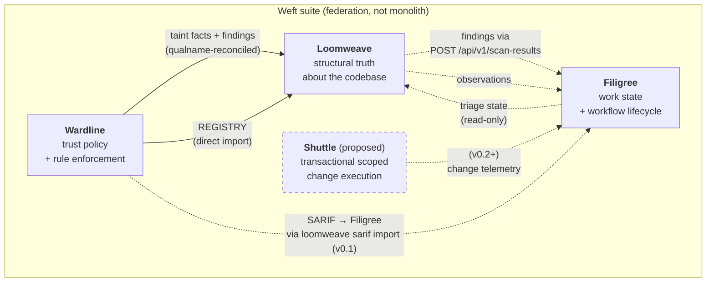
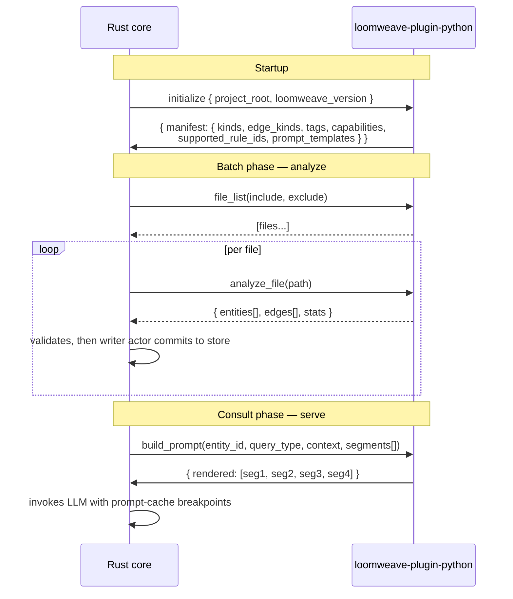
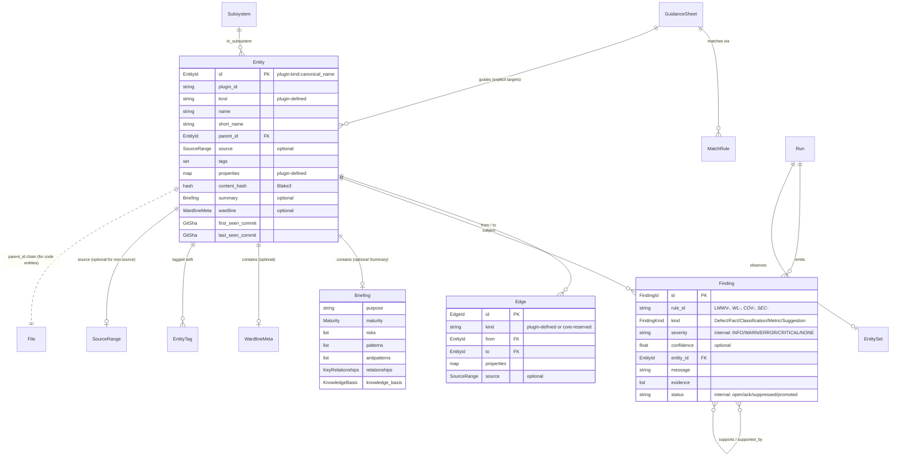
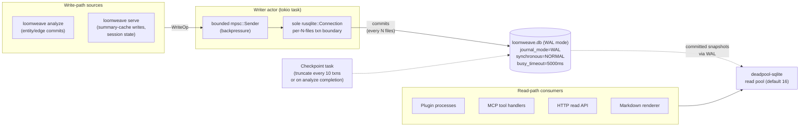
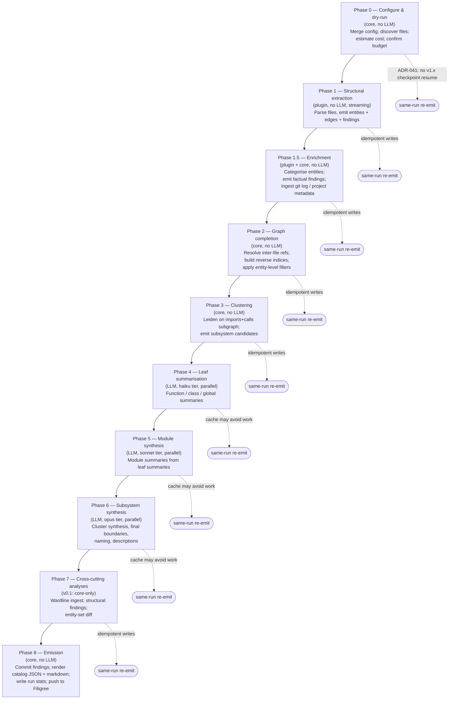
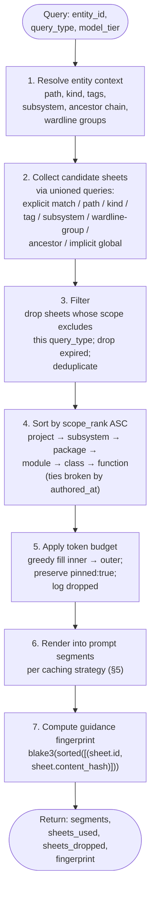

# Loomweave v1.0 — System Design

**Status**: Baselined for v1.0 release (carried forward from the v0.1 post-ADR-sprint baseline) — mid-level technical companion to requirements
**Baseline**: 2026-04-17 · **Last updated**: 2026-05-19
**Primary author**: qacona@gmail.com (with Claude)
**Companion documents**:
- [requirements.md](./requirements.md) — requirements (the *what*)
- [detailed-design.md](./detailed-design.md) — detailed design reference (implementation-level)
- [../../suite/weft.md](../../suite/weft.md) — Weft family doctrine (federation axiom, composition law, go/no-go test)

---

## Preamble

### What this document is

This is Loomweave v1.0's **system design** at mid-level technical depth. It describes how Loomweave realises the requirements: component topology, data structures at a conceptual level, key mechanisms, integration contracts, and architectural decisions. It stops before implementation detail — SQL schemas, Rust crate choices, exact rule-ID catalogues, full YAML config examples, and JSON-RPC wire specifics live in the detailed-design reference.

### How to read this

- Each section begins with an `Addresses:` header naming the requirements it satisfies. This is the unidirectional trace target for the requirements doc's `See:` lines.
- Diagrams use Mermaid (rendered natively on GitHub).
- Numbered sections follow the subsystem decomposition from the detailed-design, preserving navigation continuity across the three layers.
- ADRs are summarised in §12; authored ADR files live in [../adr/README.md](../adr/README.md). Unauthored backlog entries remain summarised here and in the detailed design.

### Layered docs

Requirements (what), system-design (how, mid-level), detailed-design (implementation). A reader asking "does Loomweave resume after a crash?" looks in requirements. A reader asking "how does it resume?" looks here. A reader asking "what's the exact `busy_timeout` setting?" looks in the detailed-design.

### Weft framing

Loomweave is one product in the Weft suite (see [../../suite/weft.md](../../suite/weft.md)). Every integration in this design satisfies the Weft federation axiom — Loomweave is useful standalone, composes pairwise with each sibling, and is enrich-only with respect to sibling data. Sibling absence reduces Loomweave's capability; it does not alter Loomweave's semantics.

---

## 1. Context & Boundaries

**Addresses**: REQ-CATALOG-01, REQ-ARTEFACT-01, REQ-ARTEFACT-02, NFR-OPS-01, NFR-OPS-02, NFR-OPS-03, CON-WEFT-01, CON-LOCAL-01, NG-03.

### The Weft family and Loomweave's place in it

Loomweave is one of four products in the Weft suite, each authoritative for one bounded concern. The v0.1 suite is Loomweave + Filigree + Wardline; Shuttle is proposed.



Integration is narrow, additive, and point-to-point. No shared runtime, no shared store, no central orchestrator — integration is what the federation axiom ([../../suite/weft.md](../../suite/weft.md) §3-§6) permits and nothing more.

### Process topology

Loomweave exposes three process types:

```mermaid
flowchart TB
    subgraph Install["loomweave install (single binary)"]
        direction TB
        Analyze["loomweave analyze<br/><i>one-shot batch</i>"]
        Serve["loomweave serve<br/><i>long-running</i>"]
    end

    subgraph PluginSub["Language plugins (subprocess)"]
        direction TB
        PyPlugin["loomweave-plugin-python<br/><i>LSP-style JSON-RPC</i>"]
    end

    Store[("`.weft/loomweave/loomweave.db`<br/>SQLite WAL<br/><i>committed to git</i>")]

    Analyze -.->|"spawn per run"| PyPlugin
    Serve -.->|"spawn on demand<br/>for consult queries"| PyPlugin
    Analyze -->|"writer actor<br/>(sole writable connection)"| Store
    Serve -->|"writer actor + read pool"| Store
    Serve <-->|"stdio: MCP<br/>loopback: HTTP"| External["MCP clients<br/>HTTP consumers<br/>(Wardline in CI)"]
```

`loomweave analyze` populates the store in a single batch. `loomweave serve` hosts MCP over stdio (for consult-mode LLM agents) plus a read-only HTTP API over loopback (for sibling tools). Plugins are subprocesses spawned by either — they own the language-specific parsing and ontology.

### UX modes

| Mode | Surface | Purpose | v0.1 status |
|---|---|---|---|
| MCP-for-LLM | `loomweave serve` over stdio | First-class product surface — consult-mode agents hold a cursor, navigate the graph, emit observations to Filigree | Primary |
| Catalog artefacts | `loomweave analyze` writes `.weft/loomweave/catalog.json` + per-subsystem markdown | "I want to read the output" cases | v1.1 (deferred — Sprint 2 amendment §3 removed boxes B.4/B.5; see [REQ-ARTEFACT-01](requirements.md#req-artefact-01--json-catalog-output) / [REQ-ARTEFACT-02](requirements.md#req-artefact-02--per-subsystem-markdown--top-level-index)) |
| Semi-dynamic wiki | HTML served by `loomweave serve` | Live finding list, in-browser guidance editing, consult entry points | v1.1 (deferred — NG-13) |

### Boundary contracts with the Weft siblings

Loomweave's integration posture is **enrich-only**. Loomweave works standalone (NFR-RELIABILITY-02's `--no-filigree` and `--no-wardline`); with siblings present, Loomweave's briefings, guidance, and findings gain context. No sibling is required for Loomweave's own data to be coherent.

- **Filigree** (enrich-only). Loomweave emits findings and observations to Filigree; Loomweave reads Filigree's triage state (`REQ-BRIEFING-05`) to enrich briefings. Filigree's absence degrades Loomweave to local-only finding writes — semantics intact, convenience reduced.
- **Wardline** (enrich-only). Loomweave carries Wardline's taint facts and qualname-reconciled findings, and reads the NG-25 decorator-vocabulary descriptor (`.weft/wardline/vocabulary.yaml`) as a plain on-disk file at extract time. Wardline's absence degrades Loomweave's annotations to "confidence_basis: loomweave_augmentation" — Loomweave still extracts what the code declares, it just doesn't cross-check against Wardline's canonical vocabulary. *(The original `wardline.yaml` + overlays + fingerprint + exceptions ingest described here was retired 2026-06-11 — Wardline never produced that format; see requirements.md REQ-GUIDANCE-04 retirement note, clarion-7c9336163e.)*
- **Shuttle** (not yet). Scope explicitly disclaimed (NG-07). Loomweave does not execute changes.

### What Loomweave is NOT

Loomweave is not a linter (NG-01, Wardline's territory), not a workflow tracker (NG-02, Filigree's territory), not an IDE (NG-03), not a grep-replacement (NG-04), not a dataflow/taint analyser (NG-05, Wardline's territory), not a hosted service (NG-06, `CON-LOCAL-01`), not a change executor (NG-07, Shuttle's territory).

---

## 2. Core / Plugin Architecture

**Addresses**: REQ-CATALOG-02, REQ-CATALOG-03, REQ-PLUGIN-01, REQ-PLUGIN-02, REQ-PLUGIN-03, REQ-PLUGIN-04, REQ-PLUGIN-05, REQ-PLUGIN-06, NFR-OPS-04, CON-WARDLINE-01.

### The responsibility split

The Rust core is language-*agnostic*, not language-*generic*. It has no fixed enum of entity kinds, no hardcoded concept of "function" or "class." Language plugins own the ontology — the set of kinds, edge kinds, tags, and rule IDs they emit — declared in a plugin manifest at startup. The core accepts anything the manifest permits.

This mirrors tree-sitter and LSP: adding a language (or a new semantic axis in an existing language) must not require upstream changes to the core.

| Owned by the core | Owned by the plugin |
|---|---|
| Storage (SQLite, writer-actor, schema, migrations) | Language parsing (AST / concrete syntax) |
| Analysis pipeline orchestration (phase order, checkpoint, resume) | Entity and edge extraction |
| Clustering (Leiden on imports + calls at module level) | Decorator / annotation detection |
| LLM provider abstraction + policy engine + prompt caching | Prompt template rendering (via `build_prompt` RPC) |
| MCP server + HTTP read API | Language-specific categorisation (entry points, HTTP routes, data models, test functions) |
| Finding emission to Filigree + compat probe | Language-specific rule emission (`LMWV-PY-*`) |
| Guidance composition + fingerprinting | Identity reconciliation for sibling-tool qualnames |

### Plugin protocol

Plugins communicate with the core via **Content-Length-framed JSON-RPC 2.0** over stdio — the same framing LSP uses. Explicit framing is required because:

- JSON content may contain newlines (newline-delimited JSON is unsafe).
- Resumability after a plugin crash needs distinguishable message boundaries — a half-written `file_analyzed` message must be recoverable or discardable as a unit, not misinterpreted as part of the next message.
- Stdio streams don't have record boundaries natively; framing provides them.

Message framing:

```
Content-Length: <n>\r\n\r\n
<n bytes of JSON>
```

The core maintains one subprocess per plugin per process. Plugin supervision uses `tokio::process::Child` with explicit `wait()` to reap zombies; SIGPIPE is ignored so a dead plugin doesn't crash the core when the core writes to its stdin; a crash-loop circuit breaker disables a plugin after >3 crashes in 60 seconds (emits `LMWV-INFRA-PLUGIN-DISABLED-CRASH-LOOP`).

### Plugin lifecycle

Plugins respond to two phases of lifecycle calls.



`analyze_file` is a single JSON-RPC **request/response** per file: the core sends one `analyze_file(path)` request and reads one matching `AnalyzeFileResult { entities[], edges[], stats }` (`plugin/host.rs::analyze_file`, `plugin/protocol.rs::AnalyzeFileResult`). The plugin's whole-file result returns in one Content-Length-framed body; the **8 MiB frame ceiling** (not a message-count channel) bounds host memory and trips a finding on a runaway plugin. The core validates each entity/edge through the host pipeline and then commits surviving rows via the writer actor.

### Plugin manifest

Each plugin declares its ontology at startup. The manifest is the contract between core and plugin — the core refuses to run with a manifest missing required fields and refuses to accept entities / edges / findings whose `kind` isn't declared.

Key fields:
- `plugin_id` — the namespace for this plugin's emissions (e.g., `python`, `java`, `core`)
- `kinds` — every entity kind the plugin can emit; the v1.0 Python plugin declares only `function`, `class`, and `module`
- `edge_kinds` — plugin-defined edge kinds; the Python plugin declares `contains`, `calls`, `references`, `imports`, `inherits_from`, and `decorates` (ontology 0.8.0). Core reserves `guides`, `emits_finding`, `in_subsystem`, and core-owned containment/source anchors.
- `tags` — declared tag vocabulary
- `capabilities` — boolean flags per capability (`calls`, `imports`, `inherits_from`, ...) with `confidence_basis` per capability (`ast_match`, `name_match`, `loomweave_augmentation`, ...)
- `supported_rule_ids` — rule IDs this plugin may emit, namespaced by prefix
- `prompt_templates` — list of named templates (`python:class:v1`, `python:module:v1`, ...) with per-segment slot specifications

### Plugin packaging

v1.0 plugins distribute as GitHub Release assets. The Python plugin ships as a
source distribution installed with `pipx install <release-asset-url>` into an
isolated venv so plugin dependencies don't conflict with the analysed project's.
A user-level `~/.config/loomweave/plugins.toml` records the resolved executable
path plus the Python version requirement. Public registry publishing and plugin
hash-pinning are deferred (NG-16).

### Python plugin specifics

The Python plugin is the v0.1 validating plugin and the reference implementation of the manifest contract.

**Parser dispatch**. The plugin parses with the standard-library `ast` module — there is **no tree-sitter and no LibCST dependency**. Structural extraction (`function` / `class` / `module` entities, qualnames, and `imports` edges) walks the `ast` tree directly. Decorator source ranges are retained in entity definition metadata, and base-class / decorator expressions are collected as relation sites that resolve into anchored `inherits_from` / `decorates` edges (ontology 0.8.0, clarion-43416be550). Call-graph and reference resolution is delegated to a managed **pyright** subprocess session (`PyrightSession`, recycled every 25 files), which serves as both the call resolver and the reference resolver. There is no `LMWV-PY-PARTIAL-PARSE` fallback path.

**Import extraction** (REQ-PLUGIN-05). `imports` edges are emitted from `import` / `from ... import` statements via the `ast` walk. Relative imports are normalized against the current module, `__init__.py` collapses to the package module name, `TYPE_CHECKING`-guarded imports carry `properties.type_only = true`, and function-local imports carry `properties.scope = "function"`. Graph algorithms filter those properties when they need runtime-only imports. Calls and references that pyright cannot resolve are recorded as **unresolved call / reference sites** (counted in run stats; unresolved *call* sites persist to `entity_unresolved_call_sites` for query-time inferred dispatch) rather than dropped. The plugin does **not** mint `python:unresolved:*` placeholder entities and does not emit `alias_of` edges for package re-exports in v1.0.

**Decorator detection** (REQ-PLUGIN-06). The extractor includes decorator lines in function/class source spans for navigation and emits anchored `decorates` edges (decorator → decorated; ontology 0.8.0). Decorator expressions reduce to their dotted path token — factory-call arguments are not extracted — and resolve to precise in-project entities only (external/builtin decorators, aliases, and self-references yield no edge). Stacking order and decorator arguments are not represented; alias-resolved decorator facts are not emitted.

**Serial-or-parallel posture**. v0.1 is serial within the plugin (one file at a time). Parallelism happens at the core level (multiple plugins, multiple LLM calls). Parallelism inside the plugin is deferred to v0.2.

### Observe-vs-enforce boundary (Principle 5)

The Python plugin is not Wardline-aware in v1.0. Future Wardline-aware extraction may detect *that* a Wardline annotation is present on a function (e.g., `@validates_shape`), while Wardline's enforcer remains responsible for deciding *whether* the function actually validates what it claims. Loomweave must not tag entities with `wardline.groups` / `wardline.annotations` until the manifest advertises that capability and the extractor emits the corresponding signals.

This boundary is preserved by:
- Loomweave not redefining Wardline's decorator vocabulary in v1.0
- Loomweave's plugin keeping `wardline_aware = false` until it emits usable Wardline-derived signals
- `LMWV-FACT-TIER-SUBSYSTEM-MIXING` (structural observation) being core-emitted (uses clustering) — Loomweave is flagging that tiers disagree; Wardline would be the tool that decides *which* tier is correct

---

## 3. Data Model

**Addresses**: REQ-CATALOG-01, REQ-CATALOG-03, REQ-CATALOG-04, REQ-CATALOG-05, REQ-CATALOG-06, REQ-CATALOG-07, REQ-BRIEFING-01, REQ-BRIEFING-04, REQ-GUIDANCE-01, REQ-FINDING-01, REQ-INTEG-WARDLINE-06.

### Property-graph generic model

Loomweave's data model is a property graph with three record types: `Entity`, `Edge`, `Finding`. Plugin-defined strings in the `kind` field keep the core language-agnostic.



### Entity

Every addressable thing in Loomweave's catalog is an `Entity`: functions, classes, modules, packages, subsystems, guidance sheets, files. The kind is a plugin-defined string; the core does not enum it.

Key invariants:
- `id` is stable across file moves that don't change the canonical qualified name (REQ-CATALOG-06).
- `source` is `None` for non-source entities (guidance sheets, subsystems).
- `content_hash` (Blake3) is the cache-invalidation key for summaries.
- `first_seen_commit` / `last_seen_commit` record git provenance; dirty-tree runs record the underlying commit (REQ-CATALOG-07).

### Edge

Typed relationships between entities. Core reserves `contains`, `guides`, `emits_finding`, `in_subsystem`; all others are plugin-defined.

Edges are deduped by `(kind, from, to)` — the plugin's emitter may observe the same call twice for overloaded names; the store is idempotent.

### Finding

A structured claim-with-evidence — Principle 4. One record shape covers five kinds:

- **Defect** — a violation or bug; carries severity
- **Fact** — an observation of structure or behaviour (no severity — facts don't have severity, they have existence)
- **Classification** — "this entity is of type X" with confidence
- **Metric** — quantitative measurement
- **Suggestion** — non-enforced recommendation

Findings carry `supports` / `supported_by` chains for cross-tool reference: Loomweave's `LMWV-FACT-TIER-SUBSYSTEM-MIXING` may be `supported_by` a Wardline `WL-TIER-INCONSISTENT` finding on one of the members.

Status vocabulary is **Loomweave-internal** (`open | acknowledged | suppressed | promoted_to_issue`); Filigree has its own vocabulary (`open | acknowledged | fixed | false_positive | unseen_in_latest`). The mapping is bidirectional (see §9).

### Entity Briefing

Structured, schema-validated summary (not prose) — REQ-BRIEFING-01. Fixed fields: `purpose`, `maturity`, `maturity_reasoning`, `risks`, `patterns`, `antipatterns`, `relationships`, `knowledge_basis`, `notes`.

`knowledge_basis` (REQ-BRIEFING-04) is computed at runtime from current guidance/finding state, not stored. A briefing gets `HumanVerified` if a matching guidance sheet was authored/reviewed in the last 90 days OR if the entity has a suppressed/acknowledged finding with a non-empty reason. Otherwise it's `StaticOnly`. `RuntimeInformed` is reserved for v0.2 (coverage ingest).

Detail levels: `short` (~60 tokens), `medium` (~300), `full` (~900), `exhaustive` (~1,800). These `~N` figures are typical token counts for well-formed entities. The hard ceilings (`≤100 / ≤400 / ≤1,500 / ≤3,600`, per REQ-BRIEFING-06) are what the renderer must enforce — exceeding them triggers truncation. The bounded-response contract is NFR-PERF-03.

### Guidance sheets

Guidance is an entity of `kind: guidance` with properties including `content` (markdown), `scope_level` (`project | subsystem | package | module | class | function` — applicability scope, ordered outer-to-inner; per ADR-024 the schema also exposes a `scope_rank` integer column for ordered queries), `scope` (which query types this sheet applies to), `match_rules` (path / tag / kind / wardline_group / subsystem / entity), `expires`, `pinned` (boolean — preserved across token-budget pressure), `provenance` (manual / wardline_derived / filigree_promotion).

Explicit entity targets get `guides` edges; pattern-based matches resolve at query time (§7 Composition).

### File entities

First-class entities (REQ-CATALOG-04). Properties include `size_bytes`, `line_count`, `mime_type`, and git metadata (`git_last_modified`, `git_last_modified_sha`, `git_churn_count`, `git_authors`). Code entities' `parent_id` chains resolve to a file entity, making the file-entity the unit of source-range anchoring.

### Subsystem entities

Core-emitted (§6 Phase 3). Properties include `cluster_algorithm` (`leiden`), `modularity_score`, `member_count`, `synthesised_at`. Member modules have `in_subsystem` edges.

### Wardline metadata

`WardlineMeta` hangs on entities that Wardline has declared. Includes `declared_tier` (one of `INTEGRAL | ASSURED | GUARDED | EXTERNAL_RAW`), `declared_groups` (1..17), `declared_boundary_contracts`, `annotation_hash` (from `wardline.fingerprint.json`), and `wardline_qualname` (the cross-tool identity handle for reconciliation).

### Identity reconciliation

Three independent identity schemes coexist across Loomweave and Wardline:

| Scheme | Example | Owner |
|---|---|---|
| Loomweave `EntityId` | `python:class:auth.tokens::TokenManager` | Loomweave |
| Wardline `qualname` | `TokenManager.verify` | Wardline's `FingerprintEntry` |
| Wardline exception-register `location` | `src/wardline/scanner/engine.py::ScanEngine._scan_file` | `wardline.exceptions.json` |

None are byte-equal for the same underlying symbol. Loomweave maintains the translation layer — not a centralised identity service (that would violate the Weft federation axiom). Each reconciliation direction uses explicit mechanics:

- **Wardline fingerprint → Loomweave**. For each `FingerprintEntry`, Loomweave computes `(file_path, qualname) → EntityId` via Wardline's `module_file_map` (available at scan time from `ScanContext`). The reverse mapping is stored on the entity as `wardline_qualname`.
- **Wardline exception → Loomweave**. The `location` string is parsed (`split("::", 1)` yields `{file_path, qualname}`); same mapping rule applies. Unresolvable entries emit `LMWV-INFRA-WARDLINE-EXCEPTION-UNRESOLVED`.
- **SARIF → Loomweave** (in the translator path). SARIF's `artifactLocation.uri` + `logicalLocations[].fullyQualifiedName` combine to produce an `EntityId`; unresolved results carry `metadata.loomweave.unresolved: true`.

The `GET /api/v1/entities/resolve` endpoint (§9) exposes this translation layer as a public API so every sibling doesn't re-implement it. Wardline keeps its scheme; Loomweave produces the join.

---

## 4. Storage

**Addresses**: REQ-CATALOG-01, REQ-CATALOG-07, NFR-OPS-03, NFR-RELIABILITY-01, NFR-SCALE-02, NFR-SCALE-03, CON-SQLITE-01.

### SQLite with writer-actor concurrency

Loomweave v0.1 uses SQLite in WAL mode as its sole persistence layer. The key decisions:

- **Single writer, multiple readers**: one writable connection lives in a dedicated tokio task (the *writer actor*); all mutations route through a bounded `mpsc::Sender<WriteOp>`.
- **Per-N-files transactions**: `loomweave analyze` commits on a rolling boundary (default N=50, configurable). A long single transaction would pin the WAL and starve readers.
- **Read pool**: `deadpool-sqlite` with default 16 read-only connections for plugin processes, MCP handlers, HTTP endpoints, and the markdown renderer. WAL lets them read the committed snapshot without blocking writers.



**Why not a single giant transaction**: Long transactions pin the WAL, prevent checkpoints from completing, and produce unbounded WAL growth. Per-batch transactions are the industry-standard posture for this workload.

**Writer-actor vs. shadow-DB**. The writer-actor model is the v0.1 default. A shadow-DB alternative (`loomweave analyze --shadow-db` writes to `.weft/loomweave/loomweave.db.new`, atomic-renames on completion) is available for users wanting zero-stale reads from a concurrent `loomweave serve` during long analyze runs. See ADR-011.

### Crash safety

SQLite WAL + writer-actor transactions + explicit `PRAGMA synchronous=NORMAL`
give crash-safe storage semantics: a SIGKILL during analyze must not corrupt
`.weft/loomweave/loomweave.db`, and committed rows survive. Per ADR-041, v1.x
`loomweave analyze --resume <run_id>` reopens the existing run id and re-walks
idempotently; it does not read `checkpoints.jsonl` or continue from a phase/file
checkpoint.

### Git-friendly storage

`.weft/loomweave/loomweave.db` is committable to git (NFR-OPS-03). SQLite files diff poorly — Loomweave ships two features to handle this:

1. **Textual export**: `loomweave db export --textual <out_dir>` produces deterministic JSON-lines dumps of entities, edges, guidance, findings. Sorted by id / (kind, from, to) so a one-entity change produces a one-line diff. Summary cache is excluded (rebuilds cheaply on next run).

2. **Merge helper**: `loomweave db merge-helper <ours> <theirs> <base>` acts as a git merge driver, producing a deterministic merge: union of entities / edges / findings (last-writer-wins on `updated_at`), guidance conflicts surfaced with a `CONFLICT` marker per affected sheet, summary cache cleared. Registration via `.gitattributes` + `.git/config` (see detailed-design §4 for exact config).

### File layout

```
<project>/.weft/loomweave/
    loomweave.db              # main store (plus WAL files beside it)
    loomweave.log             # process log
    runs/<run_id>/          # per-run artefacts (config snapshot, log.jsonl, stats.json, partial.json)
    .gitignore              # default-excludes runs/*/log.jsonl

~/.config/loomweave/
    providers.toml          # API keys, model tier mappings
    plugins.toml            # plugin registry
    defaults.yaml           # user-level policy overrides
```

### Scale

For the elspeth target (~1,100 files, ~100-200k code entities, ~500k-1M edges, hundreds to low thousands of findings, ~200k summary cache rows): expected DB size 500MB-2GB (NFR-SCALE-02). Sub-millisecond read latencies for indexed lookups.

### What the store does NOT hold

- **Raw source code** — stored by reference; plugins read files on demand.
- **Compiled ASTs** — plugins regenerate per session; cheaper than keeping an opaque blob.
- **Raw LLM request/response bodies** — logged to `runs/<run_id>/log.jsonl` for audit (default git-excluded; NFR-SEC-05).
- **Filigree issue content** — Loomweave stores association IDs; Filigree is authoritative for issue data.

---

## 5. Policy Engine

**Addresses**: REQ-CONFIG-01, REQ-CONFIG-02, REQ-CONFIG-03, REQ-CONFIG-04, REQ-CONFIG-05, REQ-BRIEFING-03, NFR-COST-01, NFR-COST-02, NFR-COST-03, CON-ANTHROPIC-01.

### Purpose

The policy engine decides, per unit of LLM work: whether to do it, which model, when (batch or on-demand), and how much it can cost. It reads `loomweave.yaml` merged with user defaults and CLI flags, then dispatches work to the LLM orchestrator.

### Config hierarchy

```
~/.config/loomweave/defaults.yaml          (user-level)
    └──┐
       ├─► merged → <project>/loomweave.yaml
       │              └──┐
       │                 ├─► merged → CLI flags (highest precedence)
       │                 │              │
       │                 │              └─► effective config for this run
```

Three-tier merge order (user defaults → project → CLI) matches user expectations. Every `loomweave analyze` run snapshots the effective config into `runs/<run_id>/config.yaml` for audit.

### Per-level policy

LLM work is scoped by *level* — function, class, global, module, subsystem, cross_cutting. Each level has `mode` (`batch | on_demand | off`), `model_tier` (`haiku | sonnet | opus`), and `summary_length` (`short | medium | full | exhaustive`). Overrides layer on top: `match: { path: "src/generated/**" }, levels: { all: { mode: off } }`.

### Profile presets

Named profiles compress the per-level configuration into one switch:

| Profile | Function | Class | Global | Module | Subsystem | Cost posture |
|---|---|---|---|---|---|---|
| `budget` | off | on_demand, haiku | filtered, haiku | batch, haiku | batch, sonnet | minimise |
| `default` | on_demand, haiku | batch, haiku | filtered, haiku | batch, sonnet | batch, opus | balanced |
| `deep` | batch, haiku | batch, sonnet | filtered, sonnet | batch, opus | batch, opus (exhaustive) | maximum depth |
| `custom` | user sets everything | | | | | — |

### Budget enforcement

> **Deferred to v1.1** (`NFR-COST-01` / `NFR-COST-03`, per [ADR-030](../adr/ADR-030-on-demand-summary-scope.md) + [Sprint 2 scope amendment §4](../../implementation/sprint-2/scope-amendment-2026-05.md)). The dry-run preflight estimate and batched-run budget watcher described below belong to the batched pipeline (Phases 4–6), which v1.0 does not run — v1.0 reaches LLM cost only lazily through the on-demand MCP `summary` tool, bounded by a **session-local token ceiling** (`BudgetLedger`). The full preflight + on-exceed machinery lands when the batched pipeline does.

Every `loomweave analyze` does a **dry-run estimate first** (default `dry_run_first: true`) — counts entities per level, applies per-tier pricing, prints the estimate, confirms with the user. At run time, a budget watcher tracks running totals; `on_exceed: stop` halts dispatch and writes `runs/<run_id>/partial.json`; `on_exceed: warn` logs and continues.

Estimate accuracy: target ±50% (NFR-COST-03). The known error sources are subsystem synthesis cost (varies with cluster sizes) and prompt-cache hit rates (which depend on guidance composition). ±50% is tight enough to be useful, loose enough to be achievable without full per-call simulation.

### LLM provider abstraction

```
trait LlmProvider {
    async fn invoke(&self, req: LlmRequest) -> LlmResponse;
    fn estimate_cost(&self, req: &LlmRequest) -> CostEstimate;
    fn tier_to_model(&self, tier: &str) -> Option<ModelId>;
    fn caching_model(&self) -> CachingModel;
}
```

**Provider posture (per [ADR-039](../adr/ADR-039-llm-provider-pivot-openrouter-cli.md), which supersedes `CON-ANTHROPIC-01`)**: the shipped `LlmProvider` implementations are `OpenRouterProvider` (the primary live transport — an OpenAI-compatible chat-completions HTTP surface; Anthropic models reachable as routed model strings, e.g. `anthropic/claude-sonnet-4.6`), `CodexCliProvider` and `ClaudeCliProvider` (subprocess bridges to the Codex / Claude CLIs), and `RecordingProvider` (record-and-replay for deterministic tests, REQ-ANALYZE-07). There is **no native Anthropic SDK provider**. All four declare `CachingModel::OpenAiChatCompletions` — OpenAI-style automatic prefix caching, not Anthropic's caller-placed four-`cache_control`-breakpoint scheme. Provider selection is configuration, not a hard-coded vendor.

### Prompt caching strategy

Prompts are assembled in four ordered segments, most-stable first, so a provider's **automatic prefix cache** (`CachingModel::OpenAiChatCompletions`, per [ADR-039](../adr/ADR-039-llm-provider-pivot-openrouter-cli.md)) reuses the shared prefix across calls. This is provider-side prefix caching, not caller-placed `cache_control` breakpoints; the segment layering below is the prompt-assembly structure that keeps the cacheable prefix stable:

| Segment | Content | Cache horizon |
|---|---|---|
| 1 | System prompt + project-level guidance | Global across the run |
| 2 | Subsystem-level or module-level guidance | Per-subsystem / per-module within the run |
| 3 | Per-entity guidance (tag, wardline-group, kind) | Within a tight batch |
| 4 | Specific entity content + immediate context | Not cached (varies per call) |

Plugins receive a `build_prompt` request with segment slots; templates render content into the specified ordered segments. For module synthesis on elspeth (~1,100 Sonnet calls), Segment 1 caches globally; for subsystem synthesis (~50 Opus calls), Segments 1+2 share across all calls — order-of-magnitude savings on expensive-tier token spend.

### Summary cache

Cache key: `(entity_id, content_hash, prompt_template_id, model_tier, guidance_fingerprint)`. Any change to any component → cache miss → fresh LLM call. Syntactic staleness is impossible.

**Semantic staleness** (three paths the cache key alone doesn't see):

1. **Graph-neighborhood drift**. Entity call-graph neighborhood shifts materially (hot-path transition) without its own text changing — its `risks` / `relationships` fields may be out of date. Mitigation: cache rows store `caller_count` / `fan_out`; entries whose neighborhood has shifted by >50% (`neighborhood_drift_threshold`, configurable) are flagged `stale_semantic: true`. Flagged rows are served with a header indicating staleness; next analyse refreshes them.

2. **Model-identity drift**. A tier name (`sonnet`) mapping to a new concrete model. The cache row already stores the concrete model; the tier resolver compares on write and treats a mismatch as a miss. No special handling needed.

3. **Guidance-worldview drift**. Guidance sheet's text is unchanged but underlying assumptions have gone stale. No automated signal; surfaced via staleness review (§7) and git-churn-based findings (`LMWV-FACT-GUIDANCE-CHURN-STALE`).

**TTL backstop**. Cache rows older than `max_age_days` (default 180) are invalidated unconditionally on next query. Bounds silently-stale briefings.

**Churn-triggered eager invalidation**. When `LMWV-FACT-GUIDANCE-CHURN-STALE` fires for a guidance sheet, cache rows whose `guidance_fingerprint` includes that sheet invalidate eagerly (not at TTL). Operators see stale-guidance findings *and* feel cost pressure to act.

### Observability

Per-run `stats.json` records total cost, per-level breakdown, per-model breakdown, cache hit rate, phase durations. Per-entity provenance in the `summary_cache` row records what was spent to produce each summary. `cost_report(since)` MCP tool returns structured cost data. Budget events emit `LMWV-INFRA-BUDGET-WARNING` / `LMWV-INFRA-BUDGET-EXCEEDED` findings.

---

## 6. Analysis Pipeline

**Addresses**: REQ-ANALYZE-01 through REQ-ANALYZE-07, REQ-FINDING-05, NFR-PERF-01, NFR-RELIABILITY-01, NFR-RELIABILITY-03.

### Phase flow



Per ADR-041, v1.x phase transitions do not write a durable checkpoint file.
`loomweave analyze --resume <run_id>` reuses the run id, re-walks safely, and
relies on existing caches where they independently apply. A future checkpoint
ADR may reintroduce phase/file skipping with explicit provider-call accounting.

### Parallelism

- **Phase 1**: one plugin process, serial within the plugin for v0.1 (REQ-PLUGIN-04). The writer actor serialises commits but batches per-N-files.
- **Phases 1.5-3**: single-threaded core-only; cheap (seconds, not minutes).
- **Phases 4-6**: parallel LLM calls capped at `max_parallel_llm` per tier (default 8). Haiku can go wider, Opus stays lower to respect rate limits.
- **Phase 7**: Wardline ingest is file I/O (fast); structural-finding computation is graph traversal, parallelised over independent regions.

### Determinism

- All summarisation uses `temperature: 0`.
- Subsystem naming uses `temperature: 0.2` (natural name variation, human-reviewable).
- Leiden clustering uses a seeded RNG; seed recorded in run stats.
- Back-to-back runs against identical source + `RecordingProvider` produce byte-identical entity/edge/finding state.

### Failure & degradation

Every failure category emits a structured finding:

| Failure | Finding | Recovery |
|---|---|---|
| Plugin parse error on file | `LMWV-PY-PARSE-ERROR` | skip file, continue |
| Plugin timeout (default 30s) | `LMWV-PY-TIMEOUT` | skip file, continue |
| Plugin process crash | `LMWV-INFRA-PLUGIN-CRASH` | core restarts plugin, resume at next file |
| LLM rate limit | (no finding; retry) | exponential backoff + jitter, up to `max_retries` |
| LLM non-transient error | `LMWV-INFRA-LLM-ERROR` | skip entity, continue |
| Budget exceeded (`warn`) | `LMWV-INFRA-BUDGET-WARNING` | log, continue |
| Budget exceeded (`stop`) | `LMWV-INFRA-BUDGET-EXCEEDED` | halt dispatch, write partial manifest |
| Plugin crashes >10% of files | `LMWV-INFRA-ANALYSIS-ABORTED` | abort, mark run failed |
| Plugin crashes >3 in 60s | `LMWV-INFRA-PLUGIN-DISABLED-CRASH-LOOP` | circuit-breaker disables plugin for the run |

No silent fallbacks. Every failure has a finding. Aggregate failure counts appear in `runs/<run_id>/stats.json`.

### Entity-set diff (deletion detection)

At Phase 7, Loomweave compares the current run's entity IDs against the prior run's (read from `runs/<prior_run>/stats.json`). For each entity present before and absent now:

- Emit `LMWV-FACT-ENTITY-DELETED` against a synthetic deletion marker (`core:deleted:{former_entity_id}`).
- Surface the deletion via Filigree so issues carrying the orphan ID can be triaged.
- Guidance sheets with explicit-entity `match_rules` pointing at the deleted ID emit `LMWV-FACT-GUIDANCE-ORPHAN`.
- Invalidate summary cache rows for the deleted entity.

Silent deletion is the no-go mode — before Rev 4, this path was silent. Two findings now guarantee the transition is visible (REQ-ANALYZE-04).

### Phase-7 structural findings

These combine signals Loomweave uniquely holds — clusters from Phase 3, Wardline tier declarations, and prior-run state — into findings no sibling tool can compute alone:

- **`LMWV-FACT-TIER-SUBSYSTEM-MIXING`** (WARN, heuristic). A subsystem has members declared across disagreeing Wardline tiers. Either a misclassification Wardline can't see or a latent tier boundary worth naming. Threshold: `min_outlier_count: 2` AND `min_outlier_fraction: 0.1` (configurable).
- **`LMWV-FACT-SUBSYSTEM-TIER-UNANIMOUS`** (INFO, deterministic). Subsystem members share a uniform declared tier. Positive signal for tier-consistency reports.
- **`LMWV-FACT-ENTITY-DELETED`** (INFO, deterministic). See above.

These belong in Phase 7 (not the plugin's Phase 1 emission) because they depend on clustering output and prior-run state — core-side concerns. Emitting them from the plugin would require the plugin to know about subsystems and prior runs (Principle 3 violation).

---

## 7. Guidance System

**Addresses**: REQ-GUIDANCE-01 through REQ-GUIDANCE-06, REQ-BRIEFING-05.

### Purpose

Institutional knowledge — what code means in context, known subtleties, reviewer priorities — attached to entities so every LLM query for that entity gets the same framing. The primary LLM-context-enrichment mechanism.

### Composition algorithm

Given `(entity_id, query_type, model_tier)`, Loomweave composes the applicable guidance:



### Authoring workflows

| Surface | Workflow |
|---|---|
| CLI | `loomweave guidance create --match path=src/auth/** --scope-level subsystem` |
| CLI | `loomweave guidance edit <id>` / `show` / `delete` |
| CLI | `loomweave guidance list [--for-entity <id>]` / `--stale` / `--expired` |
| MCP | `propose_guidance(entity_id, content, match_rules)` — produces a Filigree **observation**, not a sheet |
| CLI | `loomweave guidance promote <filigree_obs_id>` — promotes observation to sheet |
| Wardline | ~~Automatic on every `loomweave analyze` with `wardline.yaml` present~~ — retired 2026-06-11 (clarion-7c9336163e; Wardline never produced the manifest) |
| Export / import | `loomweave guidance export --to <dir>` / `loomweave guidance import <dir>` |

The `propose_guidance` → observation → explicit promote flow is the v0.1 defence against guidance-poisoning via adversarial LLM output (`NFR-SEC-02`). A single compromised LLM call cannot poison every future prompt because promotion requires operator action.

### Wardline-derived guidance

> **Retired 2026-06-11** (clarion-7c9336163e). The design below assumed Wardline publishes a `wardline.yaml` manifest carrying tiers / boundary contracts / annotation groups. Wardline never produced that format (verified against its HEAD and full history; its config is `weft.toml [wardline]`, its vocabulary artifact is the NG-25 decorator descriptor). The ingest, the derived-sheet generator, and the `LMWV-FACT-GUIDANCE-STALE` drift finding were dormant on every real project and have been removed. Historical sketch retained below for the record.

*Original (historical) text*: On every `loomweave analyze` run with `wardline.yaml` present:

- **Per declared tier assignment** → module-scope sheet: "This module contains declared Tier-N entities (list). Summaries should reflect Tier-N posture."
- **Per boundary contract** → subsystem-scope sheet: "Data crossing boundary `<contract>` carries Tier N; downstream users must not …"
- **Per annotation group in use** → project-scope sheet referencing wardline's §7 paragraph for that group.

All auto-generated sheets tagged `provenance: wardline_derived`, `pinned: true`. Regenerated every analyse; user-edited overrides preserved by ID and marked `provenance: wardline_derived_overridden`. Drift between `wardline.yaml` and derived guidance surfaces as `LMWV-FACT-GUIDANCE-STALE` finding.

### Staleness signals tied to code churn

Guidance is an accumulating stock with no intrinsic quality signal — especially `pinned: true` sheets (last dropped from token budget pressure) can stay in use long after their assumptions drift.

On every analyze, for each guidance sheet:

- Compute aggregate `git_churn_count` delta over matched entities since `authored_at` or `reviewed_at`.
- Threshold exceeded (default 50 commits; 20 for `pinned: true` sheets) → emit `LMWV-FACT-GUIDANCE-CHURN-STALE` with `confidence: 0.7, confidence_basis: heuristic`.
- Asymmetric threshold is deliberate: pinned sheets shape LLM output most, so their staleness matters most.

Auto-expiry is NOT the design — the stale signal pushes operators toward review; the decision stays with humans.

### Triage-state feedback into briefings

Filigree's finding-lifecycle state (suppressed, acknowledged) is institutional knowledge in the same shape as guidance. When rendering a briefing for an entity, Loomweave queries Filigree for findings matching the entity:

- If the briefing's `notes` field is empty and there are ≤3 suppressed/acknowledged findings with reasons → render inline as `"Operator-acknowledged: <rule_id> — <suppression_reason> (Filigree finding <finding_id>)"` per line.
- If >3 or notes is already populated → synthesise one `RiskItem` with `tag: "operator-acknowledged"`, `severity: INFO`, `description: "N findings on this entity have been triaged by operators — see Filigree for suppression reasons."`

The guidance fingerprint (§5 Caching) incorporates the set of acknowledged finding IDs so cache invalidates when triage state changes.

This is a rendering change on an existing data path (the consult tool already fetches findings for entity pages). No new storage, no new sync mechanism. Read-only from Loomweave's side.

### Lifecycle

- **Expiry**: expired sheets excluded from composition but kept in store (`loomweave guidance list --expired`); `LMWV-FACT-GUIDANCE-EXPIRED` per run.
- **Review cadence**: optional `reviewed_at`; `loomweave guidance list --stale` for sheets not touched in N days.
- **Change tracking**: edit → new `content_hash` + updated `updated_at` → dependent summary cache entries invalidate at next query.
- **Conflict**: sheets are additive; inner sheets override outer by scope-rank ordering; all sheets presented to the LLM in scope-rank order with level labels so intended overrides are visible.

---

## 8. MCP Consult Surface

**Addresses**: REQ-MCP-01 through REQ-MCP-06, NFR-PERF-02, NFR-PERF-03.

### Cursor-based session model

Every MCP session has server-held state:
- `cursor` — the current `EntityId` (the "here I am" position)
- `breadcrumbs` — navigation history
- `scope_lens` — filter for neighbour queries (`Structural | Taint | Subsystem | Wardline`)
- `session_cost` — per-session LLM spend accumulator
- `proposed_guidance`, `emitted_observations` — tracking for writes

Navigation tools update the cursor; inspection tools default to the cursor. An agent says `goto(id)` once, then `summary()`, `neighbors()`, `callers()` all operate on that entity — no re-passing the ID. This mirrors the way human operators actually consult a catalog ("look at this, then show me callers, then zoom out to the module").

### Scope lens

The scope lens shapes neighbour queries without changing their signatures:

- **Structural** (default) — callers, callees, contains, contained_in. What the graph says.
- **Taint** (v0.2) — follow Wardline tier-flow paths. Reserved for v0.2 when Wardline dataflow findings are integrated.
- **Subsystem** — stay within the current entity's subsystem. Useful for "what's in this subsystem?" questions.
- **Wardline** — follow declared boundary-contract chains. "Where does data flow in/out of this boundary?"

### Tool catalogue by category

> **The MCP server defines 42 tools** (`loomweave-mcp/src/lib.rs::list_tools` — the `tools_list_exposes_exact_docstrings` test pins the exact count and order). Five of them (`entity_summary_get`, `analyze_start`, `analyze_cancel`, `propose_guidance`, `promote_guidance`) are write-gated: the local agent-loop default registers them under `serve.mcp.enable_write_tools: true`; an explicit read-only policy (`false`) advertises 37. The categories below name the actual shipped tools, not the original aspirational cursor-based catalogue. The earlier 8-tool subset has been superseded as WP4/WP5 navigation, catalog filters, and analyze-control tools landed; the tools are **stateless and id-based** (no `goto`/`back`/`zoom` cursor session), so an agent passes an `EntityId` (obtained from `find_entity` / `entity_at`) into each call. Tools that produce LLM summaries remain on-demand per [ADR-030](../adr/ADR-030-on-demand-summary-scope.md).

**Location & lookup**: `entity_at(file, line)`, `find_entity(pattern)`, `source_for_entity(id)`, `orientation_pack(...)`, `project_status()`

**Graph navigation**: `callers_of(id, confidence)`, `call_sites(id)`, `execution_paths_from(id, max_depth, confidence)`, `neighborhood(id, confidence)`, `entity_relation_list(id, direction, kind?, confidence)` — the relation-edge read surface (`inherits_from`/`decorates`/`implements`/`derives`, direction semantics per [ADR-051](../adr/ADR-051-relation-edge-direction-and-anchor.md)), `what_tests_this(id)`

**Subsystems**: `subsystem_members(id)`, `subsystem_of(id)`

**Summaries & guidance**: `summary(id)`, `summary_preview_cost(id)`, `guidance_for(id)`

**Findings & cross-product**: `findings_for(id)`, `issues_for(id, include_contained)`, `wardline_for(id)`

**Analyze control**: `analyze_start(...)`, `analyze_status(...)`, `analyze_cancel(...)`, `index_diff(...)`

**Catalog filters & exploration shortcuts**: `find_by_tag(tag)`, `find_by_kind(kind)`, `find_by_wardline(tier?, group?)`, `find_circular_imports()`, `find_coupling_hotspots()`, `find_entry_points()`, `find_http_routes()`, `find_data_models()`, `find_tests()`, `find_deprecations()`, `find_todos()`, `high_churn(limit?)`, `recently_changed(since?)`

### Exploration-elimination shortcuts (Principle 2)

Every common explore-agent question is a pre-computed shortcut. **Most ship today** (see the catalogue above):

`find_entry_points(scope?)`, `find_http_routes(scope?)`, `find_data_models(scope?)`, `find_tests(scope?)`, `find_deprecations(scope?)`, `find_todos(scope?)`, `find_circular_imports(scope?)`, `find_coupling_hotspots(scope?)`, `find_dead_code(scope?)`, `recently_changed(since?, scope?)`, `high_churn(limit?, scope?)`, `what_tests_this(id)`

> **`find_dead_code(scope?)`** is registered (WS5b): a conservative reachability query that flags entities unreachable from the root set (entry points ∪ exported API ∪ tests ∪ HTTP routes ∪ CLI commands ∪ data models) over call+import edges. It fails toward "live" — counts all edge confidence tiers, honours reflection/dynamic-dispatch barrier tags, excludes framework-magic kinds, and emits heuristic `LMWV-FACT-DEAD-CODE-CANDIDATE` results (confidence < 1). The root categorisation tags it consumes are **not emitted by any active plugin today**, so it returns an honest signal-unavailable result (never a flood of false positives) until the root-tag emission pipeline lands (tracked follow-up). Emitting those tags during analyze is the trigger that makes it light up.
>
> **Three shortcuts remain deferred to a later release**: `find_cli_commands`, `find_config_loaders`, `find_fixtures` are not yet registered in `list_tools`.

All `scope?` parameters accept either an `EntityId` (confine results to descendants of that entity, typically a subsystem or package) or a path glob (`"src/auth/**"`). Omitted → whole project.

### Response shape

Every tool returns a common envelope:

```json
{
  "result": { /* tool-specific data */ },
  "cursor": "<updated cursor EntityId if navigation>",
  "briefing": {
    "purpose": "...",
    "maturity": "stable",
    "risks": [...],
    "patterns": [...],
    "antipatterns": [...],
    "relationships": {...}
  }
}
```

`briefing` is structured (not prose) using the `EntityBriefing` schema. At `short` detail it's ~60 tokens; at `medium`, ~300 tokens. LLMs consume it as data, not narrative.

### Token budgeting per response

Budget targets per tool:

| Tool | Budget |
|---|---|
| `summary(short)` | ≤100 tokens |
| `summary(medium)` | ≤400 |
| `summary(full)` | ≤1,500 |
| `neighbors` / `callers` / `callees` / `children` | ≤20 results × ≤50 tokens each |
| `source` | paginated if >2,000 tokens |
| `search_*` | ≤10 results |

Configurable per-session via `set_budget(tool, max_tokens)`. Unbounded responses re-introduce the context-pollution problem Loomweave exists to solve (Principle 2).

### Consent gates

Write-effect tools (`emit_observation`, `promote_observation`, `propose_guidance`, `promote_guidance`) return a draft for human confirmation by default. Headless agent-walk mode enables direct writes via client-declared `capabilities: { auto_emit: true }` on initialize.

### Session lifetime

- Created on MCP `initialize` (≤100ms, NFR-PERF-02).
- Default idle timeout: 1 hour.
- State persisted to `.weft/loomweave/sessions/<id>.json` for reconnection.
- Admin surface: `loomweave sessions list` / `loomweave sessions close <id>`.

---

## 9. Integrations

**Addresses**: REQ-FINDING-03, REQ-FINDING-04, REQ-FINDING-05, REQ-FINDING-06, REQ-HTTP-01, REQ-HTTP-02, REQ-HTTP-03, REQ-HTTP-04, REQ-INTEG-FILIGREE-01 through -05, REQ-INTEG-WARDLINE-01 through -06, CON-FILIGREE-01, CON-FILIGREE-02, CON-WARDLINE-01.

### Filigree

**Posture**: Loomweave owns file registry and code entities; Filigree owns workflow, issues, observations, findings lifecycle. Integration is via Filigree's native `POST /api/v1/scan-results` intake plus (when supported) a pluggable `RegistryProtocol` where Filigree consults Loomweave for file resolution.

#### Wire format

Loomweave POSTs to `POST /api/v1/scan-results`:

```json
{
  "scan_source": "loomweave",
  "scan_run_id": "run-2026-04-17-153002",
  "mark_unseen": true,
  "create_observations": false,
  "complete_scan_run": true,
  "findings": [
    {
      "path": "src/auth/tokens.py",
      "rule_id": "LMWV-PY-STRUCTURE-001",
      "message": "Circular import detected between auth.tokens and auth.sessions",
      "severity": "medium",
      "line_start": 12,
      "line_end": 12,
      "suggestion": "Move the shared type to a third module",
      "metadata": {
        "kind": "defect",
        "confidence": 0.95,
        "confidence_basis": "ast_match",
        "loomweave": {
          "entity_id": "python:class:auth.tokens::TokenManager",
          "related_entities": ["python:class:auth.sessions::SessionStore"],
          "internal_severity": "WARN",
          "internal_status": "open"
        }
      }
    }
  ]
}
```

Key contract properties:

- **Extension slot is `metadata`**, not `properties`. Top-level keys outside the enumerated set are silently dropped by Filigree. Loomweave's richer fields nest under `metadata.loomweave.*`.
- **Line fields are `line_start` + `line_end`** (not a single `line`).
- **Severity is lowercase `{critical, high, medium, low, info}`** on the wire. Unknown values coerce to `info` and surface in `response.warnings[]` — Loomweave inspects `warnings[]` on every POST (REQ-INTEG-FILIGREE-01).
- **`scan_run_id` lifecycle**: Loomweave creates the run at Phase 0 via `create_scan_run` MCP tool; intermediate posts use `complete_scan_run=false`; final post uses `complete_scan_run=true`. Resume (`--resume`) reuses the same `run_id` and posts with `mark_unseen=false`.

#### Severity mapping

| Loomweave internal | Filigree wire | Reverse (read-back) |
|---|---|---|
| `CRITICAL` | `critical` | `CRITICAL` |
| `ERROR` | `high` | `ERROR` |
| `WARN` | `medium` | `WARN` |
| `INFO` | `info` | `INFO` |
| `NONE` (facts) | `info` (with `metadata.loomweave.kind = "fact"`) | `NONE` |

Loomweave's internal value is preserved in `metadata.loomweave.internal_severity` for lossless round-trip. Read-back consults that field first; falls back to `severity` only if absent (e.g., for findings from Wardline that don't set Loomweave-specific metadata).

#### Dedup policy

Filigree dedups by `(file_id, scan_source, rule_id, coalesce(line_start, -1))`. Entities moving within a file produce two findings — v0.1 workaround is `mark_unseen=true` (old-position findings transition to `unseen_in_latest` on next run). `loomweave analyze --prune-unseen` removes stale `unseen_in_latest` findings older than 30 days (configurable).

Server-side per-entity dedup (a Filigree feature that supersedes this workaround) is deferred (NG-21).

#### Registry-backend consumption

When Filigree ships `registry_backend: loomweave`, Loomweave serves as Filigree's file registry: Filigree's three auto-create paths (scan-results ingest, observation creation with `file_path`, `trigger_scan`) route through `RegistryProtocol` to Loomweave's HTTP read API for `file_id` resolution.

Absent the flag, Loomweave operates in **shadow-registry mode**: findings POSTed normally, Filigree auto-creates `file_records` under its native rules, `LMWV-INFRA-FILIGREE-SHADOW-REGISTRY` appears in the compat report. Loomweave's "owns the file registry" claim downgrades to "owns the entity catalog; Filigree shadows the file mapping" — functional, but the identity story is looser.

See §11 and `CON-FILIGREE-02`.

#### Observation transport

Observations created from `loomweave analyze` (auto-generated on Wardline-derived guidance events, etc.) and from `loomweave serve` MCP `emit_observation` tool go to Filigree.

- **v0.1 path** (ADR-016): Loomweave spawns `filigree mcp` as a subprocess and uses Filigree's existing MCP `create_observation` tool over stdio. One subprocess per `loomweave analyze` invocation; one long-lived subprocess for `loomweave serve`. Observation HTTP endpoint deferred to v0.2 per Q1 scope commitment.
- **v0.2 retirement**: Filigree adds `POST /api/v1/observations` with a schema parallel to the MCP tool. Loomweave's capability probe detects presence via `HEAD /api/v1/observations`; emit path switches to HTTP and the subprocess-spawn path retires.

#### Schema compatibility

CI runs a schema-pin test against a tagged Filigree release's `GET /api/files/_schema` output. Pins `valid_severities`, `valid_finding_statuses`, `valid_association_types`, and sort-field lists. Mismatch fails CI (NFR-COMPAT-01).

`scan_source` is free-form server-side (Filigree's `_schema` doesn't enumerate it). Suite-wide reserved values: `loomweave`, `wardline`, `cov`, `sec`.

#### `metadata` nesting convention

Loomweave → `metadata.loomweave.*`. Wardline SARIF-translated findings → `metadata.wardline_properties.*`. A future tool (e.g., `cov`) would nest under `metadata.cov.*`. Published in Filigree docs to prevent collisions (v0.1 prerequisite, see §11 "Prerequisites named here").

### Wardline

**Posture**: Wardline runs at commit cadence. The long-term vision is Wardline pulling current state from Loomweave; the v0.1 reality is narrower because Wardline has no HTTP client yet. Loomweave ingests Wardline state from files on disk in v0.1.

#### State-file ingest

| File | v0.1 ingest | Use |
|---|---|---|
| `wardline.yaml` + overlays | ~~YES~~ retired | Was: tier/boundary/group declarations → `WardlineMeta` + auto-derived guidance. Wardline never produced this file; ingest removed 2026-06-11 (clarion-7c9336163e) |
| `wardline.fingerprint.json` | ~~YES~~ retired | Was part of the same manifest-bundle ingest; removed with it 2026-06-11 (clarion-7c9336163e) |
| `wardline.exceptions.json` | ~~YES~~ retired | Was part of the same manifest-bundle ingest; removed with it 2026-06-11 (clarion-7c9336163e) |
| `wardline.sarif.baseline.json` | YES (read-only) | Source for SARIF→Filigree translator |
| Other Wardline state files (compliance, conformance, perimeter, retrospective) | NO (v0.2) | Not yet relevant to Loomweave's catalog shape |

#### Direct REGISTRY import

Loomweave's Python plugin imports `wardline.core.registry.REGISTRY` at startup (requires the `wardline` package installed in the plugin's pipx venv). `REGISTRY_VERSION` is pinned at Loomweave release time. Skew behaviour (REQ-INTEG-WARDLINE-01 + NFR-COMPAT-02):

- Exact match → proceed normally.
- Additive-newer (same major, same or higher minor) → proceed with warning; decorators in the installed REGISTRY not in Loomweave's pin detected with `confidence_basis: "loomweave_augmentation"`.
- Major-bump or older → fall back to hardcoded registry mirror (`wardline_registry_v<pin>.py`); emit `LMWV-INFRA-WARDLINE-REGISTRY-MIRRORED`; findings carry `confidence_basis: "mirror_only"`.

The YAML/JSON descriptor export of REGISTRY (enabling non-Python plugins) is a Wardline v0.2 prerequisite (see §11 "Prerequisites named here", NG-25).

#### SARIF → Filigree translator

`loomweave sarif import <sarif_file> [--scan-source <name>]`. A general-purpose feature, not a Wardline-specific bridge — Semgrep, CodeQL, Trivy, and every future SARIF emitter land through the same translator.

Translator behaviour:

- SARIF `result.locations[].physicalLocation` → Filigree `path` + `line_start` + `line_end`
- SARIF `result.level` (`error / warning / note`) → Filigree severity (`high / medium / info`)
- SARIF `result.properties` → `metadata.<driver>_properties.*` (literal pass-through). Wardline's 44 `wardline.*` extension keys land under `metadata.wardline_properties.*`.
- `--scan-source` tags the emission (defaults to the SARIF driver name, lowercased).

#### Wardline-sourced flow evolution

- **v0.1**: Wardline emits SARIF to disk; `loomweave sarif import wardline.sarif.baseline.json --scan-source wardline` posts to Filigree. Translator owned Loomweave-side.
- **v0.2+** (NG-20 / ADR-015): Wardline gains a native `POST /api/v1/scan-results` emitter. What moves is *who owns the Wardline-specific mapping* — not whether SARIF translation exists. The translator stays (other SARIF sources remain).

### HTTP Read API

`loomweave serve` hosts a read-only HTTP API on `127.0.0.1` (configurable bind).

#### Endpoints

> **The pinned, authoritative wire surface is [`docs/federation/contracts.md`](../../federation/contracts.md)** (with normative fixtures under `docs/federation/fixtures/`). The illustrative catalogue below is the broader v1.1 *target*; consult contracts.md for what is actually contracted today. The shipped routes (`crates/loomweave-cli/src/http_read.rs::router`) are: the [ADR-014](../adr/ADR-014-filigree-registry-backend.md) file-registry subset (`GET /api/v1/files`, `POST /api/v1/files:resolve`, `POST /api/v1/files/batch`), entity caller/callee reads (`GET /api/v1/entities/{id}/callers|callees` + their `:batch-get` POST forms), the [ADR-038](../adr/ADR-038-sei-token-and-signature.md) SEI identity-resolution endpoints (`POST /api/v1/identity/resolve`, `…:batch`, `GET /api/v1/identity/sei/{sei}`, `…/lineage/{sei}`), the [ADR-036](../adr/ADR-036-wardline-taint-fact-store.md) Wardline taint-store routes (`/api/wardline/*`), and `GET /api/v1/_capabilities` (unauthenticated probe) — all under the [ADR-034](../adr/ADR-034-federation-http-read-api-hardening.md) authentication surface. **Still deferred**: the broad `/entities?…` query + `/entities/{id}/{summary,guidance,findings,neighbors}`, `/findings`, `/wardline/declared`, `/state`, `/health`, `/metrics`, and the **multi-scheme `GET /api/v1/entities/resolve` oracle** below. Identity translation today is split across `POST /api/v1/files:resolve` (file scheme) and `POST /api/v1/identity/resolve` (SEI). See [REQ-HTTP-01](requirements.md#req-http-01--read-endpoints-for-entities-findings-wardline-state) and [REQ-HTTP-02](requirements.md#req-http-02--entity-resolution-oracle) for the row-level deferral notices.

```
GET  /api/v1/entities?file=<path>&kind=<kind>&tag=<tag>
GET  /api/v1/entities/{id}
GET  /api/v1/entities/{id}/neighbors?edge=<kind>&direction=<dir>
GET  /api/v1/entities/{id}/summary?detail=<level>
GET  /api/v1/entities/{id}/guidance
GET  /api/v1/entities/{id}/findings
GET  /api/v1/entities/resolve?scheme=<scheme>&value=<value>[&file=<path>]
GET  /api/v1/findings?tool=<tool>&rule=<rule>&kind=<kind>&status=<status>
GET  /api/v1/wardline/declared?scope=<entity_id|path>
GET  /api/v1/state
GET  /api/v1/health
GET  /api/v1/metrics     # Prometheus-compatible
```

#### Entity resolve oracle

> **Deferred (v1.1 target).** The unified multi-scheme `GET /api/v1/entities/resolve` endpoint is not built. What ships is split: `POST /api/v1/files:resolve` (the `file_path` scheme, ADR-014) and `POST /api/v1/identity/resolve` (SEI resolution, ADR-038). The unified oracle below describes the eventual single surface.

`GET /api/v1/entities/resolve?scheme=<scheme>&value=<value>` — the identity-translation layer exposed as a public API. Target schemes: `wardline_qualname`, `wardline_exception_location`, `file_path`, `sarif_logical_location`. Response includes `resolution_confidence` (`exact | heuristic | none`) and alternative candidates for non-exact matches.

Why this exists: every sibling tool consuming Loomweave should ask in *their* native identity scheme, not embed Loomweave's ID format. The alternative is every sibling re-implementing Loomweave's ID generation, which couples them all to Loomweave's ID scheme changes. `resolve` lets them stay decoupled (enrichment, not load-bearing).

404 behaviour: returns 200 with `resolution_confidence: "none"` and empty `entity_id` — distinguishes "Loomweave doesn't know this" from "Loomweave is down."

#### Authentication — ADR-014 / ADR-034 / ADR-042 registry-backend read API

ADR-014 supersedes ADR-012 for the Filigree `registry_backend: loomweave`
HTTP read surface. The registry-backend API is loopback-only by default and may
run unauthenticated only in that local sidecar posture. ADR-034 closes the
non-loopback gap: a non-loopback bind requires both
`serve.http.allow_non_loopback: true` and a resolved authentication secret
(preferred HMAC identity via `serve.http.identity_token_env`, or legacy bearer
via `serve.http.token_env`). ADR-042 hardens the HMAC form with timestamp and
nonce freshness, while `docs/federation/contracts.md` remains the authoritative
wire surface.

ADR-012's UDS/token design is retained as historical context for the earlier
broad v0.1 HTTP API proposal, but it is not the implementation contract for the
registry-backend file-resolution endpoint.

Loopback is not a complete security boundary on modern dev hosts (shared
containers, devcontainers, and other local processes all sit on 127.0.0.1).
The current stance accepts that local-read exposure for the bounded
registry-backend API and prevents accidental network exposure through the
non-loopback guard plus mandatory authentication.

**Default — loopback only**:
- Binds only to loopback addresses.
- No Bearer header or UDS transport is required for the ADR-014 endpoint.
- Any local process that can reach the loopback port can read registry-backend
  file-resolution responses.
- Non-loopback binds are rejected unless explicitly allowed.

**Explicit non-loopback**:
- Requires `serve.http.allow_non_loopback: true`.
- Startup logs must warn that the surface is unauthenticated.
- Operators must front the endpoint with an authenticated reverse proxy or
  equivalent access-control layer.

**CI integration**: Filigree and other sibling consumers should treat
`/api/v1/_capabilities` as the compatibility probe for the registry-backend
read surface and should rely on deployment-level access control when the API is
intentionally exposed beyond loopback.

TLS is out of scope for v0.1. Operators wanting network exposure terminate TLS at a reverse proxy.

#### ETag-style caching

Every response carries `X-Loomweave-State: <hash>`. Clients can supply `If-None-Match: <hash>` for cheap revalidation; unchanged → 304.

Wardline in CI polls at commit cadence — ETag revalidation reduces load on Loomweave and bandwidth for the consumer. State hash is per-run (not per-entity) for v0.1 simplicity.

---

## 10. Security

**Addresses**: NFR-SEC-01 through NFR-SEC-05, REQ-CONFIG-05.

Security is a first-class concern in v0.1 because Loomweave sends source code to a third-party LLM provider, persists LLM-derived content in a git-committed store, and exposes an HTTP API that Wardline consumes cross-process. The threats are concrete and the defences belong in v0.1, not later.

### Threat model (v0.1 scope)

| Threat | Severity | Surface | v0.1 defence |
|---|---|---|---|
| Secret exfiltration to LLM provider | Critical | `.env`, test fixtures, committed API keys → entities → Anthropic API | Pre-ingest secret scanner; findings block LLM dispatch |
| Prompt injection via source | Critical | Adversarial docstrings / comments → briefing field values → future-prompt poisoning via cache | Schema validation + untrusted-content delimiters + `knowledge_basis: static_only` |
| Guidance poisoning via LLM-proposed sheets | High | `propose_guidance` MCP tool promotes attacker text into prompts | Manual promotion gate — proposals create observations, not sheets |
| HTTP API reachable by other local processes | Medium | `loomweave serve` on shared dev host / container | ADR-014 registry-backend API is unauthenticated but loopback-only by default; non-loopback binds are refused unless explicitly allowed and protected by operator-managed access control. |
| DB tampering via committed `.weft/loomweave/loomweave.db` | Medium | Bad actor edits DB, commits, poisons teammate briefings | Content-hash cross-check on load (v0.2); `loomweave db verify` CLI |
| LLM audit-log leakage via git | Medium | `runs/<run_id>/log.jsonl` contains request/response bodies | Default-excluded from git |
| Personal API key charged when committing team DB | Medium (operator) | Developer commits DB generated with personal key | Operator guidance; `--audit-key` hint |
| Plugin subprocess compromise | Medium | Malicious third-party plugin reads source or exhausts host resources | Hybrid authority per ADR-021: path jail, Content-Length ceiling, entity-count cap, per-plugin `prlimit` RSS. Full syscall sandbox + plugin hash-pinning deferred to v0.2 (NG-16) |

### Pre-ingest redaction

Before any file content reaches the LLM (Phases 4, 5, 6), Loomweave runs a pre-ingest secret scanner on the file buffer:

- **Tool**: bundled `detect-secrets` (or equivalent Rust-native scanner). Bundled binary — does not depend on the analysed project having `detect-secrets` installed.
- **Scope**: every file in `analysis.include` is scanned; exclusion globs apply *after* scanning (excluded files never reach the LLM regardless).
- **Policy on finding**:
  - Unredacted secret → `LMWV-SEC-SECRET-DETECTED` (severity: ERROR) + **block LLM dispatch for that file**. Entities in the file still land in the store with summaries marked `briefing_blocked: secret_present`.
  - False-positive whitelist: `.weft/loomweave/secrets-baseline.yaml` (same format as `detect-secrets`' baseline; committable and reviewable).
  - Override: `loomweave analyze --allow-unredacted-secrets` requires explicit confirmation prompt and records the override in `stats.json`.
- **Coverage**: high-entropy strings, common API key patterns (AWS, GitHub, Anthropic, Stripe, etc.), RSA private key headers, JWT-looking tokens.

This is a defensive measure, not a vulnerability scanner. False negatives exist; operators should not commit secrets and rely on Loomweave to catch them.

### Prompt-injection containment

Source files contain docstrings, comments, and string literals that may be adversarial — either from third-party packages with hostile maintainers or from unreviewed PRs in open-source repos.

Layered defences:

1. **Segment-boundary discipline**. Prompt-caching (§5) places system prompt + project-level guidance in Segment 1 (stable, trusted) and untrusted entity content in Segment 4 (varies per call, untrusted). Plugin templates render file content inside explicit `<file_content trusted="false">...</file_content>` delimiters; templates are reviewed as part of plugin release.

2. **Structured-output schema validation**. Every briefing round-trips through the `EntityBriefing` JSON schema. An injected "output plain text instead" instruction fails validation; after one failed retry the run emits `LMWV-INFRA-BRIEFING-INVALID` and skips the entity.

3. **Controlled-vocabulary enforcement**. `patterns` and `antipatterns` fields are constrained to the core + plugin vocabulary. Novel tags are logged as `LMWV-FACT-VOCABULARY-CANDIDATE` for human review; they don't promote into future prompts silently.

4. **`knowledge_basis` propagation**. Briefings derived from LLM output (no human review) carry `knowledge_basis: static_only`. Agents consuming Loomweave briefings should treat `static_only` claims as hypotheses, not assertions.

5. **Guidance promotion gate**. `propose_guidance(entity_id, content, rules?)` creates a **Filigree observation**, not a sheet. Promotion to a sheet requires explicit `loomweave guidance promote <obs_id>` CLI action. A single adversarial LLM call cannot poison every future prompt.

6. **Prompt-cache poisoning countermeasures**. Summary-cache hits are keyed on `guidance_fingerprint`; a newly-promoted guidance sheet changes the fingerprint and forces re-summarisation. A compromised briefing never re-enters the cache without the prompt that produced it re-running.

### Defences NOT in v0.1 (named, not silent)

- **Full syscall sandbox** (seccomp/landlock). v0.1 enforces path jail, Content-Length ceiling, per-run entity-count cap, and per-plugin RSS limit per ADR-021; syscall-level isolation defers to v0.2 alongside plugin hash-pinning (NG-16).
- **Per-endpoint HTTP auth scoping**. v0.1 token is project-wide.
- **DB content-hash verification on load**. Malicious DB edit caught by the next `loomweave analyze` (content hashes re-computed) but not at `loomweave serve` boot time.
- **Automatic redaction** of secrets *within* files (v0.1 blocks the whole file; v0.2+ may replace secret substrings with `<redacted>` placeholders).
- **TLS on HTTP API**. Operators wanting network exposure run behind a reverse proxy terminating TLS.

### Audit surface

Every security-relevant event emits a finding:

- `LMWV-SEC-SECRET-DETECTED` — unredacted secret blocked LLM dispatch
- `LMWV-SEC-UNREDACTED-SECRETS-ALLOWED` — operator overrode block
- `LMWV-INFRA-HTTP-NON-LOOPBACK-UNAUTHENTICATED` — `loomweave serve` running the ADR-014 HTTP read API on a non-loopback bind with `serve.http.allow_non_loopback: true`; per-startup WARN log
- `LMWV-INFRA-BRIEFING-INVALID` — schema validation failed twice (possible injection)
- `LMWV-SEC-VOCABULARY-CANDIDATE-NOVEL` — novel vocabulary tag proposed by LLM (light signal; mostly harmless)

Findings feed Filigree via the normal exchange. Security-focused operators can `filigree list --label=security --since 7d` across the suite.

### Operator guidance (non-code security)

Some risks sit outside Loomweave's code but inside the operator's responsibility:

- **Use project-scoped API keys, not personal ones, when committing the DB**. Briefings in `.weft/loomweave/loomweave.db` were paid for by whoever ran analyze; a teammate pulling your committed DB benefits from calls your personal key paid for. Use an Anthropic project key, not your personal key.
- **Rotate tokens when a committed DB exposes a stale model's output**. If the DB was generated with a leaked or exposed API key, the token is already used; briefings aren't themselves secret but the key's usage fingerprint is.
- **Review `.weft/loomweave/.gitignore` before first commit**. Default excludes `runs/*/log.jsonl` (raw LLM request/response bodies); opting in to commit logs ships source excerpts to the repo — a choice, not an oversight.

Operator-guidance documentation lives in the detailed-design §10 for procedural depth.

---

## 11. Suite Bootstrap

**Addresses**: REQ-INTEG-FILIGREE-05, NFR-RELIABILITY-02, NFR-OBSERV-04, CON-WEFT-01, CON-FILIGREE-02.

### What this section is

Loomweave v0.1 is not joining an existing Weft fabric — it is the work that weaves the fabric for the v0.1 suite of Loomweave + Filigree + Wardline. The integration reconnaissance (`2026-04-17-loomweave-integration-recon.md`) verified that cross-tool surface area the Rev-1 design assumed is mostly not yet implemented: Wardline has no HTTP client, Filigree has no `registry_backend` flag or pluggable file registry, no cross-tool fixtures exist.

This section describes **Loomweave's side** of the coordination: the capability-probe it runs at every analyse, the degraded modes it falls back into when sibling capabilities are absent, and what Loomweave asks of sibling products as prerequisites. Per the Weft federation axiom ([../../suite/weft.md](../../suite/weft.md) §3, §6), there is **no central orchestrator** — each product handles its own integration surface, and sibling absence is a graceful degradation, not a failure.

### Capability negotiation at `loomweave analyze` startup

Before Phase 0 (discovery + dry-run), Loomweave probes each sibling and emits **exactly one** `LMWV-INFRA-SUITE-COMPAT-REPORT` finding summarising the discovered state. One finding collapses scattered runtime surprises into a single auditable signal.

Probes:

1. **Filigree presence and version**: `GET <filigree_base_url>/api/files/_schema`. Record version, enums, flag presence.
2. **Filigree `registry_backend`**: look for the flag in `_schema.config_flags`. Absent → shadow-registry fallback.
3. **Filigree `/api/v1/observations`**: `HEAD` request. In v0.1 the absence is expected (MCP-spawn is the v0.1 path per ADR-016); presence signals v0.2 is installed and Loomweave switches to HTTP.
4. **Wardline REGISTRY version**: `import wardline.core.registry; registry.REGISTRY_VERSION`. Compared against Loomweave's pin.
5. **Wardline SARIF schema version**: read `wardline.sarif.baseline.json` header; check `wardline.propertyBagVersion`.

The `LMWV-INFRA-SUITE-COMPAT-REPORT` carries `metadata.loomweave.*` with every probe result — operators read one finding to understand how this run will behave.

### Per-component fallbacks

| Prerequisite not satisfied | Fallback mode | Signal |
|---|---|---|
| Filigree unreachable entirely | Local-only: findings write to `runs/<run_id>/findings.jsonl`; no observations | `--no-filigree` explicit; `LMWV-INFRA-FILIGREE-UNAVAILABLE` per batch |
| Filigree present; `registry_backend` absent | Shadow-registry: POSTs normally; Filigree auto-creates `file_records` under native rules | `LMWV-INFRA-FILIGREE-SHADOW-REGISTRY` |
| `filigree` binary missing from `PATH` | Observation emission disabled; observations queued to `runs/<run_id>/deferred_observations.jsonl` for later replay | `LMWV-INFRA-FILIGREE-BINARY-MISSING` |
| Wardline package not installable in plugin venv | Registry-mirror: hardcoded `wardline_registry_v<pin>.py` | `--no-wardline` explicit; `LMWV-INFRA-WARDLINE-REGISTRY-MIRRORED` |
| Wardline installed; `REGISTRY_VERSION` additive-newer | Proceed with warning; additive decorators `loomweave_augmentation` | `LMWV-INFRA-WARDLINE-REGISTRY-ADDITIVE-SKEW` |
| Wardline installed; `REGISTRY_VERSION` major-bump or older | Mirror-mode | `LMWV-INFRA-WARDLINE-REGISTRY-MIRRORED` |
| SARIF with unknown property-bag version | Best-effort translation; per-removed-key findings | `LMWV-INFRA-SARIF-SCHEMA-UNKNOWN`, `LMWV-INFRA-SARIF-KEY-REMOVED` |
| `loomweave sarif import` not installed | Wardline findings don't reach Filigree via Loomweave; operators use Wardline's existing SARIF→GitHub Security path | Manual — no auto-findings |

The degraded modes exist so Loomweave ships on its own timeline, not the slowest of three. Per-run compat state is recorded in `runs/<run_id>/stats.json` so historical regressions in suite capability are visible.

### Prerequisites named here (full detail in detailed-design §11)

**Filigree side** (ADRs 014, 017 in detailed-design):
- `registry_backend` config flag + pluggable `RegistryProtocol` (the schema-surgery)
- `scan_source` coordination + schema-compat contract test + `metadata` nesting convention published

**Filigree-side nice-to-have (v0.2+)**:
- `POST /api/v1/observations` HTTP endpoint (ADR-016 — v0.1 uses MCP-spawn; endpoint retirement trigger)

**Wardline side** (ADRs 015, 018 in detailed-design):
- Stable `REGISTRY_VERSION` export + `LEGACY_DECORATOR_ALIASES` table
- YAML/JSON descriptor of REGISTRY (enables non-Python plugins — v0.2)
- Native `POST /api/v1/scan-results` emitter (v0.2; v0.1 uses Loomweave-side SARIF translator)

**Joint**:
- Cross-tool test fixtures (mock Filigree server, Wardline SARIF corpus, schema-pin test)
- Three-tool coordinated release plan (belongs in the implementation plan, not this design)

### Why no central orchestrator

Per [../../suite/weft.md](../../suite/weft.md) §6, Weft does not own a coordination runtime. Capability negotiation is point-to-point — Loomweave probes Filigree and Wardline directly, each sibling exposes its own surfaces, no "Weft bus" mediates. This section *is* that posture, expressed as Loomweave's own behaviour.

If a future requirement emerged for "what if more tools join the suite and the probe matrix explodes?", the answer per the federation axiom is not "build a shared registry" — it is "each joining tool implements its own probe; each existing tool adds handling for it." That keeps the pairwise composition rule honest even as the suite grows.

---

## 12. Architecture Decisions

**Addresses**: canonical record of load-bearing design decisions. This table is the canonical home for ADR **status, priority, and rationale summaries**. Authored ADRs live as standalone files in [../adr/README.md](../adr/README.md). Backlog items remain summarised here until authored.

The parallel listing in [detailed-design.md §11](./detailed-design.md#11-architecture-decisions) is a narrower table carrying only "where captured in this design" for implementer navigation. It deliberately does not duplicate status, priority, or rationale — those live here.

### ADR summaries (P0 + P1)

| # | Decision | Status | Priority | Rationale summary |
|---|---|---|---|---|
| ADR-001 | Rust for the core | Accepted | P0 | Primary author directive. Single-binary ship, mature ecosystem (axum/rusqlite/tokio), plugin interop via subprocess. Not subject to alternatives analysis. |
| ADR-002 | Plugin transport: Content-Length framed JSON-RPC 2.0 subprocess | Accepted | P0 | Binary-safe framing, resumability after crash, alignment with LSP patterns. Alternatives: newline-delimited JSON (unsafe for content with embedded newlines), Wasm (too early for plugin authoring ergonomics), embedded Python (couples core to Python runtime). |
| ADR-003 | Entity ID scheme: symbolic canonical-name; file path as property; EntityAlias v0.2 | Accepted | P0 | Cross-tool identity must survive file moves. Path-embedded IDs silently detach every reference; symbolic IDs survive 80% case (file move without rename). Rename tracking via EntityAlias deferred; manual `--repair-aliases` workaround in v0.1. |
| ADR-004 | Finding-exchange format: Filigree-native intake; `metadata.loomweave.*` nesting | Accepted | P0 | Filigree's `POST /api/v1/scan-results` is production path; SARIF requires either translation or Filigree-side work. Nesting convention under `metadata` dict (verified verbatim preservation) avoids silent drops of extension fields. |
| ADR-005 | `.weft/loomweave/` git-committable by default; DB included, run logs excluded | To author | P1 | Shared-analysis-state story benefits small teams; run logs may contain source excerpts appropriate to Anthropic but not git. Default-exclude run logs via `.gitignore`; opt-in to commit. |
| [ADR-006](../adr/ADR-006-clustering-algorithm.md), [ADR-032](../adr/ADR-032-weighted-components-clustering-fallback.md) | Clustering algorithm: Leiden (with weighted-components fallback) on imports + calls subgraph | Accepted | P0 | Leiden's connected-community guarantee fixes disconnected-cluster defects. Directed, weighted (reference_count); module-level. `weighted_components` is the deterministic fallback selectable via config when a local component cut is preferred. Modularity score recorded, not enforced (v0.1); weak threshold is reported via finding. |
| [ADR-007](../adr/ADR-007-summary-cache-key.md) | Summary cache key design: `(entity_id, content_hash, prompt_template_id, model_tier, guidance_fingerprint)` + TTL backstop + churn-eager invalidation | Accepted | P0 | Full 5-part key captures all syntactic staleness paths; TTL backstop (180d default) bounds semantic staleness the key alone doesn't see; churn-eager invalidation on `LMWV-FACT-GUIDANCE-CHURN-STALE` makes stale-guidance pressure visible via cost. Neighborhood-drift flag (`stale_semantic: true`) rather than forced miss preserves NFR-COST-02's 95% hit-rate target. Block C1 spike validates the assumption. |
| ADR-008 | (Superseded by ADR-014.) | Superseded | — | Initial Filigree file-registry displacement design was "feature flag"; recon showed it's schema surgery. See ADR-014. |
| ADR-009 | Structured briefings vs free-form prose | To author | P2 | Principle 2 requires bounded, composable responses; prose is neither. Schema validation also enables prompt-injection detection (schema-invalid → possible injection). |
| ADR-010 | MCP as first-class surface — lock-in cost vs ecosystem reach | To author | P2 | Anthropic's MCP standard is the ecosystem's current centre of gravity for LLM tool integrations; lock-in cost is acknowledged but the ecosystem reach outweighs it for v0.1. Strategic review at v0.3+. |
| [ADR-011](../adr/ADR-011-writer-actor-concurrency.md) | Writer-actor concurrency model (vs shadow-DB swap) | Accepted | P0 | Single writer actor + per-N-files transactions (default N=50) is the committed shape; `--shadow-db` opt-in for zero-stale-read scenarios. Design-review §2.2 CRITICAL flag retires. SQLite-concurrency-under-load assumption named as v0.2 validation task (`NG-28` proposed). |
| [ADR-012](../adr/ADR-012-http-auth-default.md) | Historical HTTP read-API auth proposal: UDS default with TCP+token fallback | Superseded for ADR-014 registry-backend API | P0 | ADR-014 now owns the registry-backend HTTP read API posture: unauthenticated loopback-only by default, non-loopback refused unless explicitly allowed and protected externally. ADR-012 remains context for the earlier broad HTTP API proposal. |
| [ADR-013](../adr/ADR-013-pre-ingest-secret-scanner.md) | Pre-ingest secret scanner with LLM-dispatch block | Accepted | P0 | Rust-native port of detect-secrets rule set (preserves NFR-OPS-04 single-binary). File-level block on detection; structural extraction preserved; briefings marked `briefing_blocked: secret_present`. `.weft/loomweave/secrets-baseline.yaml` for false-positives. `--allow-unredacted-secrets` requires TTY confirm OR explicit `--confirm-allow-unredacted-secrets=yes-i-understand` in CI. |
| [ADR-014](../adr/ADR-014-filigree-registry-backend.md) | Filigree `registry_backend` flag + pluggable `RegistryProtocol` — schema surgery, not config flip | Accepted | P0 | Four NOT-NULL foreign keys on `file_records(id)` + three auto-create paths require a real interface, not a flag. Loomweave's shadow-registry fallback preserves v0.1 shipability when Filigree hasn't landed the surgery. |
| [ADR-015](../adr/ADR-015-wardline-filigree-emission.md) | Wardline→Filigree emission ownership: Loomweave-side SARIF translator (v0.1), native Wardline POST (v0.2) | Accepted | P0 | Wardline has no HTTP client today (`integration-recon:339`); adding one is a refactor not on the v0.1 timeline. Loomweave-side translator ships independently; translator stays permanent for Semgrep / CodeQL / etc. `weft.md` §5 asterisk 1 retires when native emitter lands. Revision trigger: Block C2 spike showing emitter is ≤1 day of work promotes to v0.1. |
| [ADR-016](../adr/ADR-016-observation-transport.md) | Observation transport: `filigree mcp` subprocess spawn (v0.1); `POST /api/v1/observations` HTTP (v0.2) | Accepted | P0 | Per Q1 scope commitment, observation HTTP transport deferred to v0.2. v0.1 emits via Loomweave spawning `filigree mcp` subprocess and calling existing `create_observation` MCP tool over stdio. v0.2 HTTP endpoint is the retirement trigger; capability probe detects via `HEAD /api/v1/observations`. |
| [ADR-017](../adr/ADR-017-severity-and-dedup.md) | Severity mapping + rule-ID round-trip + dedup via `mark_unseen=true` | Accepted | P0 | Loomweave internal severity (`INFO/WARN/ERROR/CRITICAL`) maps to Filigree wire (`critical/high/medium/low/info`). Round-trip preserves internal via `metadata.loomweave.internal_severity`. `mark_unseen=true` is the v0.1 dedup workaround for entities moving within files; server-side per-entity dedup deferred to v0.2 (NG-21). Fixes `LMWV-INFRA-PARSE-ERROR` vs `LMWV-PY-PARSE-ERROR` drift (Issue 7). |
| [ADR-018](../adr/ADR-018-identity-reconciliation.md) | Identity reconciliation: Loomweave maintains translation layer; Wardline owns its qualnames; direct REGISTRY import with version pinning | Accepted | P0 | Three identity schemes exist (Loomweave EntityId, Wardline qualname, exception-register location). Loomweave is the translator — it owns the catalog that makes the qualnames meaningful. Forcing Wardline to adopt Loomweave's scheme would be centralisation drift (weft.md §6). Plugin-level REGISTRY import is a named initialization-coupling asterisk (weft.md §5) retiring when Wardline publishes a YAML/JSON descriptor (NG-25, v0.2). |
| ADR-019 | SARIF property-bag preservation: Wardline's 44 `wardline.*` extension keys round-trip through `metadata.wardline_properties.*` | To author | P1 | Filigree preserves `metadata` verbatim. Literal pass-through handles Wardline's extensive extension keys; unknown schema versions use best-effort mapping with per-removed-key findings. |
| ADR-020 | Degraded-mode policy: Loomweave ships on its own timeline; `--no-filigree` / `--no-wardline` explicit flags | To author | P1 | Per `CON-WEFT-01`, sibling absence reduces Loomweave's capability but must not alter its semantics. Explicit flags name the degradation; the compat probe report makes per-run state auditable. |
| [ADR-021](../adr/ADR-021-plugin-authority-hybrid.md) | Plugin authority model: hybrid — plugin declares capabilities in manifest, core enforces minimum-safe controls (path jail, Content-Length ceiling, entity-count cap, per-plugin `prlimit` RSS) | Accepted | P0 | The design currently assumes "trusted extension" but ships to a security-conscious audience that will assume "validated input". Full sandbox is over-investment for a single first-party plugin; trusted-extension default leaves four threats open (T-01, T-08, T-11, T-12 per panel `09-threat-model.md` §7). Hybrid closes T-08/T-11/T-12 and raises the floor on T-01 at tractable v0.1 cost. |
| [ADR-022](../adr/ADR-022-core-plugin-ontology.md) | Core/plugin ontology ownership boundary: plugins declare entity kinds and edge kinds; core validates shape without embedding ontology | Accepted | P0 | Principle 3 requires "plugin owns ontology; core owns algorithms" but the data-layer analogue at the core/plugin boundary was unstated. Plugins own kind vocabulary for language-specific concepts; the core validates shape (identifier grammar, reserved-kind namespace, rule-ID namespacing, emission-declaration contract) without baking in Python-specific assumptions. Shapes ADR-002's RPC surface, ADR-003's `{kind}` ID component, and ADR-006's clustering subgraph. |

### Writing cadence

Most ADRs are now authored and Accepted as standalone files in [../adr/](../adr/README.md); ADR-008 is Superseded (by ADR-014); ADR-009, ADR-010, ADR-019, and ADR-020 remain backlog and stay summarised here and in the ADR index until the code that depends on them is ready to land. Additional Sprint-2-era ADRs (ADR-023 through ADR-032) were authored after this design layer was baselined; their summaries live in the ADR index rather than in this section. Any decision reversal during implementation (e.g., "writer-actor doesn't work; switching to shadow-DB") requires a new dated ADR revision, not an edit to the original.

Authored ADR text (context, decision, alternatives considered, consequences, status) lives in [../adr/README.md](../adr/README.md). These summaries are the navigation aid; the canonical record of completed decisions is the ADR collection itself.

---

## Glossary

The terms below are the ones this system-design layer relies on most heavily:

| Term | Definition |
|---|---|
| **Briefing** | Structured summary answering a fixed set of questions about an entity. |
| **Entity** | Typed node in Loomweave's property graph. |
| **Entity ID** | Stable identifier of the form `{plugin_id}:{kind}:{canonical_qualified_name}`. |
| **Edge** | Typed relationship between entities such as `contains`, `calls`, or `imports`. |
| **Finding** | Structured claim-with-evidence; may be a defect, fact, classification, metric, or suggestion. |
| **Guidance fingerprint** | Hash of the guidance sheets applied to a query; part of the summary-cache key. |
| **Plugin manifest** | YAML declaration of a plugin's kinds, edges, rules, and capabilities. |
| **Scope lens** | Query/session filter that biases neighbour lookups toward a relationship family. |
| **Tier** | Wardline trust classification preserved verbatim by Loomweave. |
| **Writer-actor** | Single task that owns SQLite writes; other tasks submit mutations through it. |
| **Pre-ingest redaction** | Secret scan that runs before any file content is sent to the LLM provider. |
| **Capability probe / compat report** | Startup check of sibling-tool availability that emits one compatibility finding. |
| **`scan_run_id`** | Filigree-owned identifier for a finding-emission run. |

See [detailed-design.md](./detailed-design.md) Appendix B for the full glossary.

---

**End of Loomweave v1.0 system design.**
